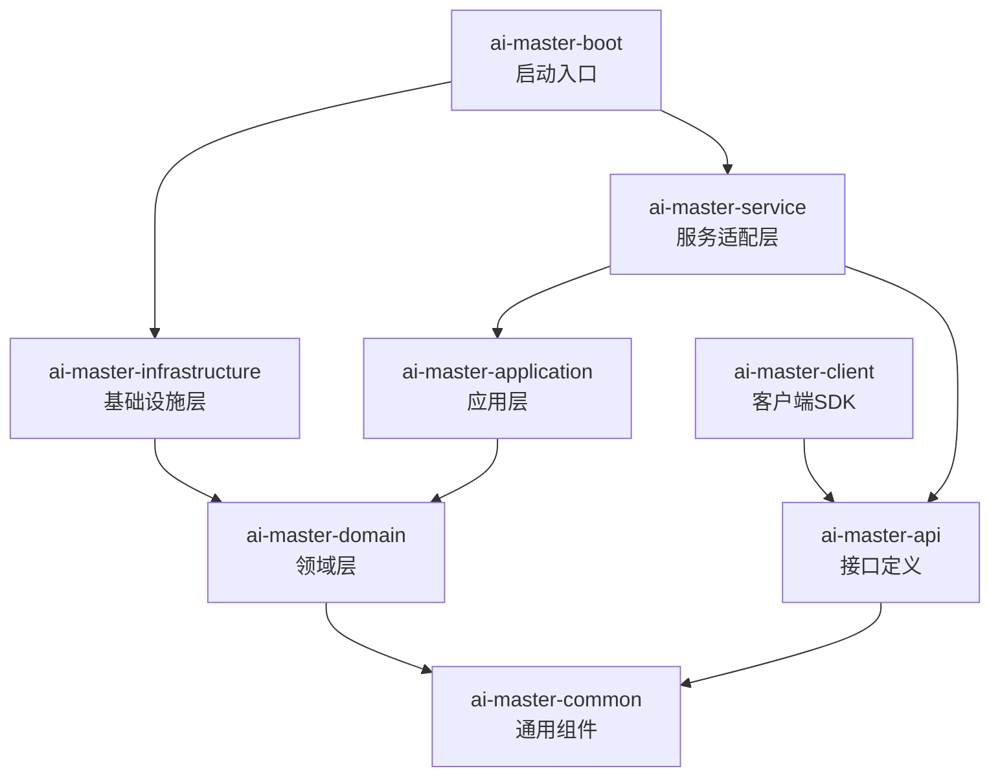
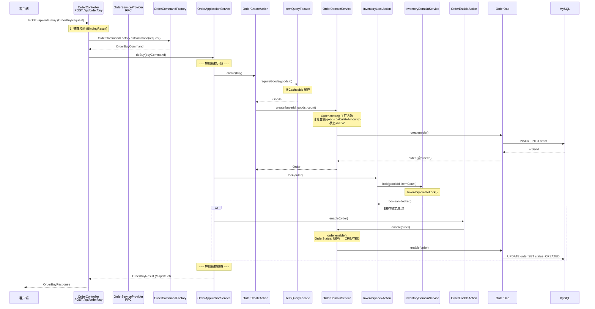
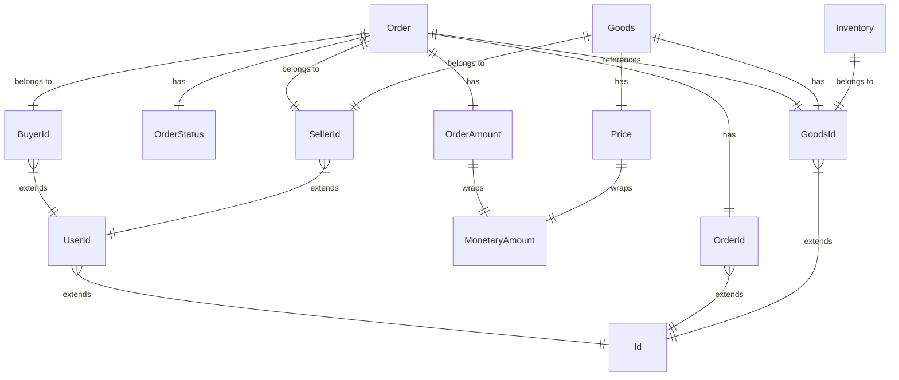
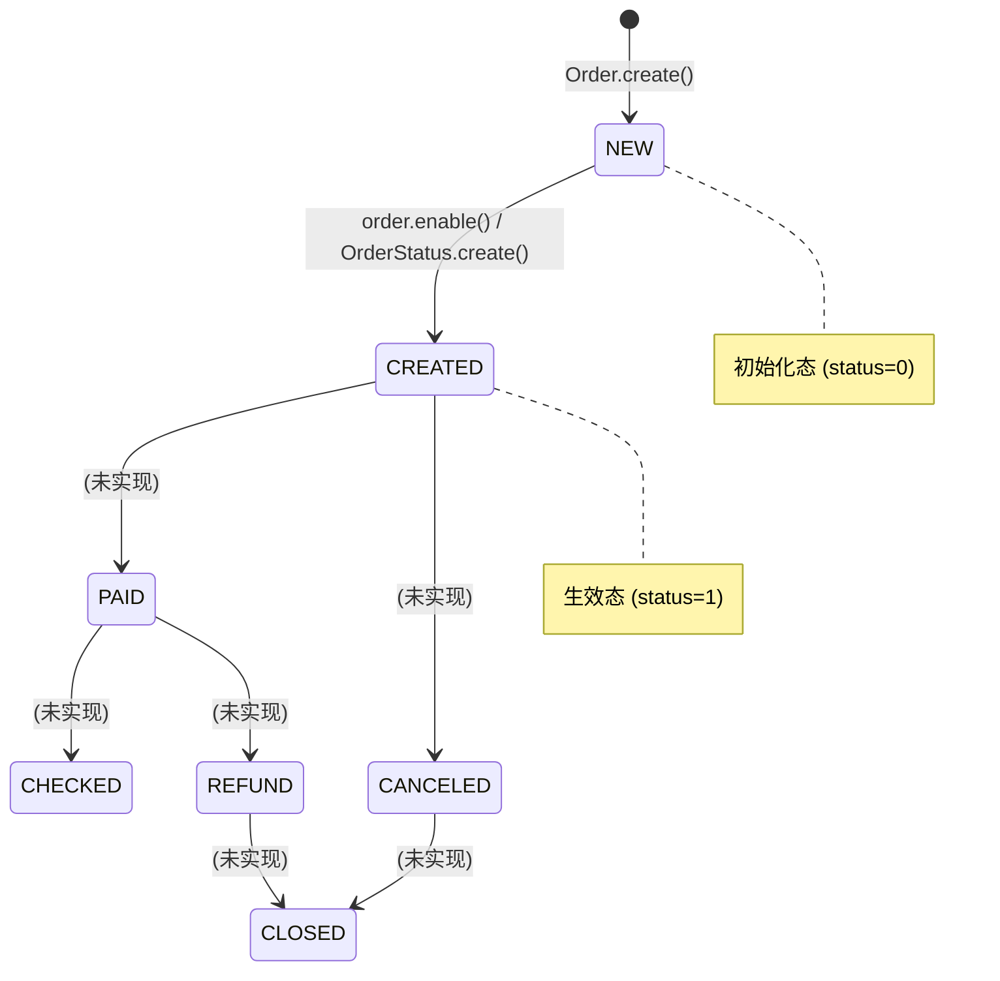

# [AI Master Restaurant Order] 系统知识库

> 最后更新: 2026-02-12
> 分析进度: [完成]
> 分析版本: v2.0 (增强版)

## 项目概述

基于 Spring Boot 与 DDD（领域驱动设计）架构构建的餐厅点餐系统后端交易引擎，负责从用户下单、商品库存锁定到订单全生命周期管理的核心业务逻辑。

| 属性 | 值 |
|------|-----|
| 项目名称 | ai-master |
| 业务领域 | 餐饮点餐交易引擎 (Restaurant Order) |
| 技术栈摘要 | Java 17, Spring Boot 2.7.10, MyBatis, MySQL, MapStruct, Lombok |
| 代码规模 | 54 个 Java 文件, ~1735 行 Java 代码 |
| 核心模块数 | 8 (boot, api, application, client, common, domain, infrastructure, service) |
| 领域上下文数 | 3 (Order 订单, Goods 商品, Inventory 库存) + 1 (User 用户) |
| 启动类 | `com.only.ai.master.boot.ApplicationStarter` |
| 二方依赖 | Transformer v1.2.10 (内部框架) |
| 作者 | only |
| 始创日期 | 2020-05-22 |

## 快速导航

| 导航项 | 路径 | 说明 |
|--------|------|------|
| 核心入口 | [ApplicationStarter.java](ai-master-boot/src/main/java/com/only/ai/master/boot/ApplicationStarter.java) | Spring Boot 启动类 |
| 配置文件 | [application.properties](ai-master-boot/src/main/resources/application.properties) | 环境配置 |
| 产品需求 | [docs/prd.md](docs/prd.md) | 产品需求说明书 |
| 架构设计 | [docs/add.md](docs/add.md) | 架构设计说明书 |
| 测试设计 | [docs/tdd.md](docs/tdd.md) | 测试设计说明书 |
| API文档 | [docs/api/](docs/api/) | API 接口文档 |

## 技术架构

### 技术栈

#### 后端
| 类别 | 技术 | 版本 | 备注 |
|------|------|------|------|
| 语言 | Java | 17 | LTS 版本 |
| 框架 | Spring Boot | 2.7.10 | 核心容器与 Web 框架 |
| ORM | MyBatis | 2.3.2 (starter) | 数据持久层 |
| 数据库 | MySQL | Driver 5.1.30 | 关系型数据库 |
| 连接池 | Druid | 1.2.23 | 阿里巴巴数据库连接池 |
| 对象映射 | MapStruct | 1.5.0.Final | 编译时对象转换 |
| 工具库 | Lombok | 1.18.34 | 简化 POJO 编写 |
| API文档 | Swagger | 2.7.0 | springfox-swagger2 |
| 序列化 | Jackson | (Spring Boot 内置) | SNAKE_CASE 命名策略 |
| 二方库 | Transformer | 1.2.10 | 内部框架 (call, common, dubbo, util, exception, dao) |

#### 基础设施
| 类别 | 技术 | 用途 |
|------|------|------|
| 构建 | Maven 3.8+ | 多模块构建与依赖管理 |
| 部署 | Spring Boot Fat Jar | java -jar 运行 |
| 监控 | `@Call` 注解 | Transformer 提供的调用日志与性能监控 |
| 缓存 | Spring Cache `@Cacheable` | 商品查询缓存 |

### 模块结构

```
ai-master-restaurant-order-openspec/
├── ai-master-boot/              # 启动入口，配置装载，JSON序列化配置
├── ai-master-api/               # API 接口定义 (接口、DTO、Request、Response)
├── ai-master-service/           # 服务适配层 (RPC Provider、HTTP Controller、工厂转换)
├── ai-master-application/       # 应用层 (用例编排 ApplicationService、Action、Command、Result)
├── ai-master-domain/            # 领域层 (聚合根、实体、值对象、领域服务、仓储接口、领域事件)
├── ai-master-infrastructure/    # 基础设施层 (DAO 实现、Mapper、Entity、外部调用适配)
├── ai-master-client/            # 客户端 SDK (远程调用客户端，尚未实现)
├── ai-master-common/            # 通用工具类与基础组件 (暂无源文件，通用模型在 domain 中)
├── docs/                        # 知识库文档
└── openspec/                    # OpenSpec 配置 (AI Agent 相关)
```

### 模块依赖关系



### 各层数据流转与对象映射

```
Request(api)  →  Command(application)  →  Domain Model(domain)  →  Entity(infrastructure)  →  DB
                   ↓                           ↓
              Result(application)        Domain Event(domain)
                   ↓
             Response(api/DTO)
```

| 转换步骤 | 方向 | 转换工具 | 位置 |
|----------|------|----------|------|
| Request → Command | 入参转换 | `BeanHelper.copyProperties` (Transformer) | `OrderCommandFactory` (service) |
| Command → Domain | 创建领域对象 | `Order.create()` 工厂方法 | `OrderDomainService` (domain) |
| Domain → Entity | 持久化 | `OrderFactory.instance()` 手动映射 | `OrderFactory` (infrastructure) |
| Entity → Domain | 查询还原 | `GoodsFactory.valueOf()` 手动映射 | `GoodsFactory` (infrastructure) |
| Domain → Result | 结果封装 | `OrderBuyResultFactory` (MapStruct) | `OrderBuyResultFactory` (application) |
| Result → Response/DTO | 输出转换 | `OrderBuyDTOFactory` (MapStruct) | `OrderResultFactory` (service) |

## 核心业务

### 功能模块清单

| 模块 | 上下文 | 路径 | 职责 | 核心类/文件 | 状态 |
|------|--------|------|------|------------|------|
| 交易服务 | Order | `ai-master-service` | 接收下单请求，参数校验，协议转换 | `OrderServiceProvider`, `OrderController` | ✅ 已实现 |
| 订单管理 | Order | `ai-master-domain/order` | 订单创建、状态流转、金额计算 | `Order`, `OrderDomainService`, `OrderStatus` | ✅ 已实现 |
| 库存管理 | Inventory | `ai-master-domain/inventory` | 商品库存锁定 | `Inventory`, `InventoryDomainService` | ✅ 已实现 |
| 商品查询 | Goods | `ai-master-domain/goods` | 商品信息查询与价格计算 | `Goods`, `Price`, `ItemQueryFacade` | ✅ 已实现 |
| 订单查询 | Order | `ai-master-domain/order/facade` | 订单详情查询 | `OrderQueryFacade` | ⬜ 仅占位 |
| 客户端SDK | Order | `ai-master-client` | 远程调用客户端 | `OrderClient` | ⬜ 未实现 |

### 关键业务流程

#### 下单流程 (完整调用链)



#### 调用链路总结

```
HTTP/RPC入口 → 参数校验 → DTO→Command转换
    → OrderApplicationService.doBuy() [用例编排]
        → OrderCreateAction.create()
            → ItemQueryFacade.requireGoods() [@Cacheable 商品查询]
            → OrderDomainService.create() [创建订单+持久化]
        → InventoryLockAction.lock()
            → InventoryDomainService.lock() [库存锁定]
        → OrderEnableAction.enable() [条件：锁定成功]
            → OrderDomainService.enable() [状态 NEW→CREATED + 持久化]
    → OrderBuyResultFactory.toResult() [MapStruct 结果映射]
→ OrderResultFactory.asResponse() [Result→Response转换]
```

### 领域模型

#### 领域对象全景

| 领域对象 | DDD 类型 | 所属上下文 | 职责 | 关键属性 | 代码位置 |
|----------|----------|-----------|------|----------|----------|
| `Order` | **聚合根** | Order | 订单一致性边界，含工厂方法与状态机 | orderId, goodsId, buyerId, sellerId, itemCount, amount, status | [Order.java](ai-master-domain/src/main/java/com/only/ai/master/order/domain/model/Order.java) |
| `OrderId` | 值对象 | Order | 订单唯一标识 | id (Long, >0) | [OrderId.java](ai-master-domain/src/main/java/com/only/ai/master/order/domain/model/OrderId.java) |
| `OrderAmount` | 值对象 | Order | 订单金额封装 | amount (MonetaryAmount) | [OrderAmount.java](ai-master-domain/src/main/java/com/only/ai/master/order/domain/model/OrderAmount.java) |
| `OrderStatus` | 枚举 | Order | 订单状态机 | NEW(0)→CREATED(1)→PAID(2)→... | [OrderStatus.java](ai-master-domain/src/main/java/com/only/ai/master/order/domain/model/OrderStatus.java) |
| `OrderCreatedEvent` | 领域事件 | Order | 订单创建事件（已定义，未使用） | 继承 OrderEvent | [OrderCreatedEvent.java](ai-master-domain/src/main/java/com/only/ai/master/order/domain/event/OrderCreatedEvent.java) |
| `Goods` | **聚合根** | Goods | 商品信息与金额计算 | goodsId, title, price, sellerId | [Goods.java](ai-master-domain/src/main/java/com/only/ai/master/goods/domain/model/Goods.java) |
| `GoodsId` | 值对象 | Goods | 商品唯一标识 | id (Long, >0) | [GoodsId.java](ai-master-domain/src/main/java/com/only/ai/master/goods/domain/model/GoodsId.java) |
| `Price` | 值对象 | Goods | 商品单价，含溢出检查 | amount (MonetaryAmount) | [Price.java](ai-master-domain/src/main/java/com/only/ai/master/goods/domain/model/Price.java) |
| `Inventory` | 值对象 | Inventory | 库存模型 (可用/占用/已售/锁定) | goodsId, available, locked, sold, lock | [Inventory.java](ai-master-domain/src/main/java/com/only/ai/master/inventory/domain/model/Inventory.java) |
| `MonetaryAmount` | 值对象 | Common | 不可变金额对象 (元/分双单位，支持折扣/加减) | monetaryAmount (BigDecimal), scale | [MonetaryAmount.java](ai-master-domain/src/main/java/com/only/ai/master/common/domain/MonetaryAmount.java) |
| `Id` | 基类 | Common | ID 抽象基类 (>0 校验) | id (Long) | [Id.java](ai-master-domain/src/main/java/com/only/ai/master/common/domain/Id.java) |
| `ValueObject<T>` | 接口 | Common | 值对象基接口 | `T value()` | [ValueObject.java](ai-master-domain/src/main/java/com/only/ai/master/common/domain/ValueObject.java) |
| `BuyerId` | 值对象 | User | 买家标识 | 继承 UserId | [BuyerId.java](ai-master-domain/src/main/java/com/only/ai/master/user/domain/model/BuyerId.java) |
| `SellerId` | 值对象 | User | 卖家标识 | 继承 UserId | [SellerId.java](ai-master-domain/src/main/java/com/only/ai/master/user/domain/model/SellerId.java) |
| `UserId` | 值对象 | User | 用户标识基类 | 继承 Id | [UserId.java](ai-master-domain/src/main/java/com/only/ai/master/user/domain/model/UserId.java) |

#### 对象关系图



#### 状态机 (Order Status)



**已实现流转**: NEW(0) → CREATED(1)（仅当 `this == NEW` 才允许调用 `create()`，否则抛 `IllegalStateException`）

**已定义未实现**: PAID(2), CHECKED(3), REFUND(4), CANCELED(5), CLOSED(6), NONE(-1)

### 领域术语表

| 术语 | 中文 | 定义 | 代码表现 |
|------|------|------|----|
| Order | 订单 | 一次交易的核心聚合，封装买家、商品、金额、状态 | `Order` 聚合根 |
| Goods | 商品 | 可购买的餐饮商品，含标题和价格 | `Goods` 聚合根 |
| Inventory | 库存 | 商品可售数量管理（可用/占用/已售/锁定） | `Inventory` 值对象 |
| MonetaryAmount | 金额 | 不可变金额对象，精确到分，支持折扣与加减 | `MonetaryAmount` final 类 |
| Price | 价格 | 商品单价，支持总价计算（含溢出检查） | `Price` 值对象 |
| Inventory Lock | 库存锁定 | 下单时的预扣减操作，可用→占用转移 | `InventoryDomainService.lock()` |
| Enable | 订单生效 | 库存锁定成功后，订单从初始化态转为有效态 | `order.enable()` → `OrderStatus.create()` |
| Action | 业务动作 | 应用层的原子业务步骤 | `OrderCreateAction`, `InventoryLockAction`, `OrderEnableAction` |
| Command | 命令 | 应用层的输入对象 (CQS 模式的 C) | `OrderBuyCommand` |
| Result | 结果 | 应用层的输出对象 | `OrderBuyResult` |
| Facade | 查询门面 | 领域层的查询入口 | `ItemQueryFacade`, `OrderQueryFacade` |
| `@Call` | 调用追踪 | Transformer 提供的方法级日志与性能监控注解 | `@Call(elapsed=1200, sample=10000)` |

### 核心实体模型

| 领域对象 | 数据表名(推测) | 持久化实体 | 主要字段 | 关联关系 |
|----------|--------------|-----------|----------|----------|
| `Order` | `order` | `OrderEntity` | id, goodsId, buyerId, sellerId, amount(分), status(int) | 聚合根，引用 GoodsId |
| `Goods` | 外部服务获取 | `GoodsEntity` | id, title, price(分) | 通过 `GoodsCall` 远程获取 |
| `Inventory` | `inventory`(推测) | (暂无Entity) | goodsId, available, locked, sold, lock | 弱关联 GoodsId |

### 仓储与基础设施

| 仓储接口 (Domain) | 实现类 (Infrastructure) | 数据源 | 说明 |
|-------------------|------------------------|--------|------|
| `OrderRepository` | `OrderDao` (@Repository) | MySQL (OrderMapper) | 订单 CRUD，使用 `OrderFactory` 进行 Domain↔Entity 转换 |
| `GoodsRepository` | `GoodsDal` (@Repository) | 外部服务 (GoodsCall) | 商品查询，通过 RPC/接口调用获取，使用 `GoodsFactory` 还原领域对象 |
| `InventoryRepository` | (未发现实现类) | 推测 MySQL | 库存锁定操作 |

### 业务规则清单

| 规则ID | 描述 | 适用场景 | 代码实现位置 | 约束详情 |
|--------|------|----------|-------------|----------|
| BR-001 | 下单参数校验 | 下单入口 | [OrderBuyRequest.validator()](ai-master-api/src/main/java/com/only/ai/master/order/api/module/request/OrderBuyRequest.java) | buyerId、goodsId、itemCount 非空，itemCount > 0 |
| BR-002 | 初始订单状态 | 订单创建 | [Order.create()](ai-master-domain/src/main/java/com/only/ai/master/order/domain/model/Order.java) | 创建时状态默认 NEW(0) |
| BR-003 | 状态流转约束 | 订单生效 | [OrderStatus.create()](ai-master-domain/src/main/java/com/only/ai/master/order/domain/model/OrderStatus.java) | 仅 NEW 可流转为 CREATED，否则抛 IllegalStateException |
| BR-004 | 库存先锁后生效 | 下单编排 | [OrderApplicationService.doBuy()](ai-master-application/src/main/java/com/only/ai/master/order/application/service/OrderApplicationService.java) | 库存锁定成功 → 订单生效；失败 → 订单保持 NEW |
| BR-005 | 金额计算 | 订单创建 | [Goods.calculateAmount()](ai-master-domain/src/main/java/com/only/ai/master/goods/domain/model/Goods.java) → [Price.calculateAmount()](ai-master-domain/src/main/java/com/only/ai/master/goods/domain/model/Price.java) | 总价 = 单价(分) × 数量，含 Long 溢出检查 |
| BR-006 | ID 合法性 | 全局 | [Id (构造函数)](ai-master-domain/src/main/java/com/only/ai/master/common/domain/Id.java) | id 非空且 > 0 |
| BR-007 | 金额合法性 | 全局 | [MonetaryAmount.create()](ai-master-domain/src/main/java/com/only/ai/master/common/domain/MonetaryAmount.java) | amount/cent ≥ 0, scale ≥ 0 |
| BR-008 | 订单生效持久化 | 订单状态更新 | [OrderDao.enable()](ai-master-infrastructure/src/main/java/com/only/ai/master/order/infrastructure/dao/OrderDao.java) | 数据库更新失败 (count=0) 时抛 IllegalStateException |

## 开发规范

> 参考 `~/ai/rules/` 目录下的开发规范体系

### 需求与设计
- PRD 模板参考 `~/ai/rules/requirement/requirement-template.md` (SCQA 表达模式)
- 概要设计参考 `~/ai/rules/design/architecture-template.md` (DDD 六边形架构)
- 详细设计参考 `~/ai/rules/design/design-template.md`
- 设计原则参考 `~/ai/rules/design/design-guidelines.md`

### 代码规范
- Java 编码规范: `~/ai/rules/coding/java-guidelines.md`
- 工程结构规范: `~/ai/rules/coding/project-structure.md` (DDD 六边形分层)
- Maven 规范: `~/ai/rules/coding/maven-guidelines.md`
- Git 工作流: `~/ai/rules/coding/git-guidelines.md`
- 文档注释规范: `~/ai/rules/document/document-guidelines.md`

### 测试规范
- 测试指南与质量门禁: `~/ai/rules/testing/testing-guidelines.md`
- 覆盖率要求: ≥80% (Jacoco)
- 测试命名: `{ClassName}Test` / `should{Behavior}When{Condition}`
- 分层策略: 领域模型(单元) → 应用服务(集成) → API接口(E2E)

### 命名规范 (基于项目实际)

| 层级 | 组件类型 | 命名模式 | 示例 |
|------|----------|----------|------|
| API | 服务接口 | `{Aggregate}Service` | `OrderService` |
| API | 请求类 | `{Aggregate}{Action}Request` | `OrderBuyRequest` |
| API | 响应类 | `{Aggregate}{Action}Response` | `OrderBuyResponse` |
| API | DTO | `{Aggregate}{Action}DTO` | `OrderBuyDTO` |
| Service | RPC实现 | `{Aggregate}ServiceProvider` | `OrderServiceProvider` |
| Service | HTTP控制器 | `{Aggregate}Controller` | `OrderController` |
| Service | 转换工厂 | `{Aggregate}CommandFactory` / `{Aggregate}ResultFactory` | `OrderCommandFactory` |
| Application | 应用服务 | `{Aggregate}ApplicationService` | `OrderApplicationService` |
| Application | 业务动作 | `{Aggregate}{Action}Action` | `OrderCreateAction`, `InventoryLockAction` |
| Application | 命令 | `{Aggregate}{Action}Command` | `OrderBuyCommand` |
| Application | 结果 | `{Aggregate}{Action}Result` | `OrderBuyResult` |
| Application | 结果工厂 | `{Aggregate}{Action}ResultFactory` (MapStruct) | `OrderBuyResultFactory` |
| Domain | 聚合根 | `{Aggregate}` | `Order`, `Goods` |
| Domain | 值对象 | `{ValueObject}` | `OrderId`, `Price`, `MonetaryAmount` |
| Domain | 领域服务 | `{Aggregate}DomainService` | `OrderDomainService` |
| Domain | 查询门面 | `{Entity}QueryFacade` | `ItemQueryFacade`, `OrderQueryFacade` |
| Domain | 仓储接口 | `{Aggregate}Repository` | `OrderRepository` |
| Domain | 领域事件 | `{Aggregate}{Past}Event` | `OrderCreatedEvent` |
| Infra | DAO | `{Aggregate}Dao` / `{Aggregate}Dal` | `OrderDao`, `GoodsDal` |
| Infra | 数据实体 | `{Aggregate}Entity` | `OrderEntity`, `GoodsEntity` |
| Infra | Mapper | `{Aggregate}Mapper` | `OrderMapper` |
| Infra | 工厂 | `{Aggregate}Factory` | `OrderFactory`, `GoodsFactory` |

## 约定与约束

### 关键约束
- [x] 使用 Java 17 特性
- [x] JSON 序列化使用 SNAKE_CASE 命名策略
- [x] 忽略未知 JSON 字段 (`FAIL_ON_UNKNOWN_PROPERTIES=false`)
- [x] 空值不序列化 (`NON_NULL`)
- [x] 日期格式 `yyyy-MM-dd HH:mm:ss`
- [x] 金额单位为「分」(Long)，通过 `MonetaryAmount` 封装元/分转换
- [ ] 数据库驱动版本较低 (5.1.30)，需注意兼容性

### 接入层约定
- RPC 接口与 HTTP 接口双入口，共享同一应用服务
- RPC 端使用 `OrderBuyRequest.validator()` 方法校验
- HTTP 端使用 `@Valid` + `BindingResult` Bean Validation 校验
- 统一使用 `@Call(elapsed=1200, sample=10000)` 监控

### 文档同步规则
**自动更新触发条件:**
- 新增或修改 API 接口
- 数据模型变更（领域对象或数据库表）
- 业务规则发现或变更
- 重大架构调整

**更新要求:**
- 更新 AGENTS.md 相关内容和"最后更新"时间戳
- 同步更新 `docs/` 下相关文档
- 在"会话历史摘要"中记录变更

## 技术债务登记

| ID | 描述 | 位置 | 优先级 | 建议方案 |
|----|------|------|--------|----------|
| TD-001 | MySQL 驱动版本过旧 (5.1.30) | `ai-master-infrastructure/pom.xml` | P2 | 升级到 mysql-connector-j 8.x |
| TD-002 | `OrderEnableAction` 缺少 `@Component` 注解 | [OrderEnableAction.java](ai-master-application/src/main/java/com/only/ai/master/order/application/action/OrderEnableAction.java) | **P0** | 添加 `@Component` 注解，否则 Spring 无法注入 |
| TD-003 | `InventoryLockAction` 注释错误 ("优惠计算") | [InventoryLockAction.java](ai-master-application/src/main/java/com/only/ai/master/order/application/action/InventoryLockAction.java) | P3 | 修正注释为"库存锁定" |
| TD-004 | `OrderQueryFacade.requireOrder()` 返回 null (硬编码) | [OrderQueryFacade.java](ai-master-domain/src/main/java/com/only/ai/master/order/domain/facade/OrderQueryFacade.java) | P1 | 实现实际查询逻辑或移除占位代码 |
| TD-005 | `OrderClient.buy()` 抛 `UnsupportedOperationException` | [OrderClient.java](ai-master-client/src/main/java/com/only/ai/master/order/client/OrderClient.java) | P2 | 实现 RPC/HTTP 远程调用逻辑 |
| TD-006 | `InventoryRepository` 缺少基础设施层实现 | `ai-master-domain/inventory/domain/repository/` | P1 | 创建 `InventoryDal`/`InventoryDao` 实现类 |
| TD-007 | `OrderCreatedEvent` 已定义但未被使用 | `ai-master-domain/order/domain/event/` | P3 | 发布事件到 MQ 或 Spring Event |
| TD-008 | 测试覆盖率 0% | 全局 | **P0** | 按 `docs/tdd.md` 添加领域层单元测试 |
| TD-009 | `OrderBuyRequest.validator()` 返回值语义反转 | [OrderBuyRequest.java](ai-master-api/src/main/java/com/only/ai/master/order/api/module/request/OrderBuyRequest.java) | P1 | `validator()` 在参数无效时返回 `true`，语义易混淆 |
| TD-010 | `OrderServiceProvider` 缺少 `@Component`/`@Service` 注解 | [OrderServiceProvider.java](ai-master-service/src/main/java/com/only/ai/master/order/service/rpc/OrderServiceProvider.java) | P1 | 可能通过 Dubbo XML 配置注册，需确认 |
| TD-011 | `OrderBuyDTO` 为空类，无任何字段 | [OrderBuyDTO.java](ai-master-api/src/main/java/com/only/ai/master/order/api/module/dto/OrderBuyDTO.java) | P2 | 添加返回给客户端的订单信息字段 |

## 会话历史摘要

### 2026-02-12 - v2.0 增强版 (全面逆向分析)
- 阅读全部 54 个 Java 源文件，建立完整代码理解
- 绘制完整调用链序列图和领域模型 ER 图
- 建立详细的领域对象全景表 (14个对象)
- 梳理 8 条业务规则并关联代码位置
- 发现并登记 11 项技术债务 (含 2 个 P0 级别潜在 Bug)
- 整理完整的命名规范对照表 (覆盖全部 7 层)
- 补充数据流转与对象映射关系

### 2026-02-11 - v1.0 初始化
- 创建知识库结构
- 识别技术栈: Java 17, Spring Boot 2.7.10
- 识别核心模块: boot, api, infrastructure, domain, etc.
