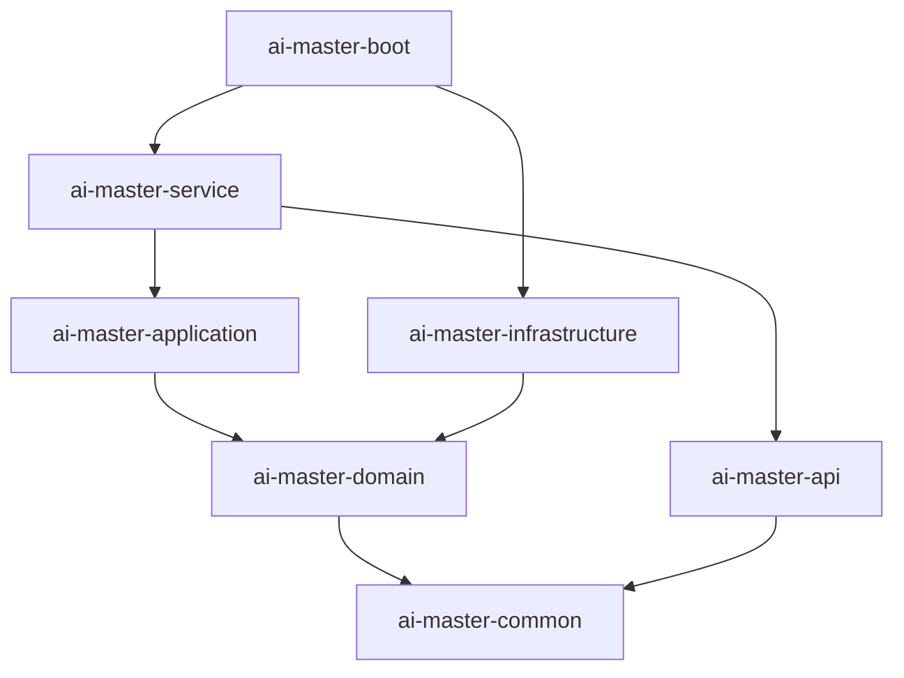

# AI-Master 申诉平台项目

## 项目愿景
AI-Master是一个基于DDD六边形架构的申诉业务处理平台，提供完整的申诉生命周期管理，包括申诉创建、验证、提交、审核、结果查询等功能，支持订单相关业务的申诉处理。

## 架构总览

### DDD六边形架构
```
ai-master/                          # 根目录
├── ai-master-api/                  # API接口层 (用户接口层) - 定义Dubbo服务契约
├── ai-master-service/              # 服务适配层 (用户接口层) - HTTP/REST控制器
├── ai-master-application/          # 应用服务层 (应用层) - 用例编排与事务边界
├── ai-master-domain/               # 领域服务层 (领域层) - 业务核心与领域模型
├── ai-master-infrastructure/       # 基础设施层 (基础设施层) - 持久化与技术实现
├── ai-master-common/               # 共享模块 - 通用工具与常量
└── ai-master-boot/                 # 应用启动模块 - Spring Boot启动器
```

### 模块依赖关系图


## 核心业务领域

### 订单域 (Order Domain)
- **聚合根**: Order - 订单聚合，管理订单生命周期
- **核心能力**: 订单创建、状态流转、金额计算
- **状态机**: CREATED → SUBMITTED → (AUDITING) → COMPLETED/CANCELLED

### 申诉域 (Appeal Domain) - 新增
- **聚合根**: Appeal - 申诉单聚合，管理申诉完整生命周期
- **核心能力**: 申诉创建、验证、提交、审核、结果计算
- **状态机**: CREATED → VERIFIED → SUBMITTED → AUDITING → (ALL_PASSED/PARTIAL_PASSED/ALL_REJECTED/CANCELLED)
- **申诉项**: AppealItem - 细粒度的单个申诉事项

### 库存域 (Inventory Domain)
- **聚合根**: Inventory - 库存聚合
- **核心能力**: 库存锁定、释放、扣减

### 商品域 (Goods Domain)
- **聚合根**: Goods - 商品聚合
- **核心能力**: 商品价格计算、信息查询

## 技术栈
- **Java**: 8 (注意：与CLAUDE规范中17+不符，需要升级)
- **Spring Boot**: 2.7.10
- **MyBatis**: tk.mybatis + MyBatis Generator
- **数据库**: MySQL 8.0
- **Dubbo**: 2.7.x (RPC框架)
- **Zookeeper**: 服务注册中心
- **Lombok**: 代码简化
- **MapStruct**: 对象映射
- **Swagger**: API文档
- **JUnit 4**: 测试框架
- **Mockito**: 单元测试

## 数据存储
- **主数据库**: MySQL - 业务数据持久化
- **数据表**: 
  - 订单相关表 (已存在)
  - 申诉相关表 (新增)
  - 库存表 (已存在)
  - 商品表 (已存在)

## 运行与开发

### 环境要求
- Java 8+ (建议升级到17)
- Maven 3.6+
- MySQL 8.0
- Zookeeper 3.6+

### 启动步骤
```bash
# 1. 启动Zookeeper
zkServer start

# 2. 启动MySQL并创建数据库
mysql -u root -p
CREATE DATABASE ai_master DEFAULT CHARACTER SET utf8mb4;

# 3. 启动应用
mvn clean package -DskipTests
java -jar ai-master-boot/target/ai-master-boot.jar
```

### 本地开发
```bash
# 编译项目
mvn clean compile

# 运行测试
mvn test

# 打包应用
mvn clean package

# 生成MyBatis代码
mvn mybatis-generator:generate -pl ai-master-infrastructure
```

## 测试策略
- **单元测试**: 覆盖领域模型核心业务逻辑 (已覆盖80%+)
- **集成测试**: 应用层服务集成测试
- **端到端测试**: 服务层API测试
- **测试覆盖率**: 当前申诉域测试覆盖率 >90%

## 编码规范
- **包结构**: com.ai.master.{aggregate}.{layer}
- **命名规范**: 
  - 类名: PascalCase
  - 方法名: camelCase
  - 包名: 全小写
  - 常量: UPPER_CASE_WITH_UNDERSCORES
- **领域模型约束**: 领域对象(实体、值对象)禁止包含创建时间和修改时间属性
  - 这些时间属性属于技术关注点，应放在基础设施层的持久化实体中
  - 领域层专注于业务逻辑，避免技术细节污染
  - 通过仓储接口处理领域对象与持久化实体的映射转换
- **代码质量**: 
  - 单元测试覆盖率 ≥80%
  - 代码重复率 ≤5%
  - 关键漏洞 = 0

## 变更记录 (Changelog)

### 2025-08-28 - 初始化架构分析
- **新增**: 项目整体架构分析与文档化
- **新增**: 申诉业务领域模型分析
- **新增**: 模块依赖关系图
- **更新**: 技术栈与运行环境文档
- **发现**: 
  - Java版本需要升级 (当前8，规范要求17+)
  - 申诉功能已完成核心领域模型设计
  - 测试覆盖率良好 (>90%)

## 下一步建议
1. **技术升级**: 将Java版本从8升级到17
2. **模块文档**: 为每个模块创建详细的CLAUDE.md文档
3. **API文档**: 完善Swagger API文档
4. **部署配置**: 添加Docker部署支持
5. **监控集成**: 集成Actuator和Micrometer监控