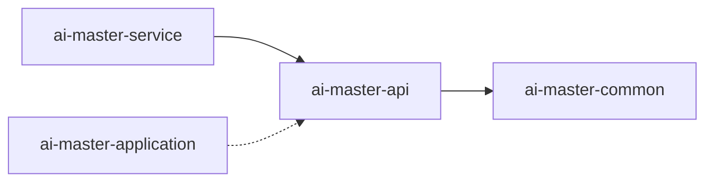

# AI-Master API模块

[← 返回项目根目录](../CLAUDE.md)

## 模块定位
**层级**: 用户接口层 (API层)  
**职责**: 定义Dubbo服务契约，提供跨服务的RPC接口定义  
**消费者**: 外部微服务、前端应用、第三方系统

## 模块结构

```
ai-master-api/
├── pom.xml                          # Maven配置
├── src/
│   ├── main/
│   │   └── java/
│   │       └── com/ai/master/
│   │           ├── appeal/api/      # 申诉服务API
│   │           └── order/api/       # 订单服务API
│   └── test/                        # 测试代码
```

## 核心服务接口

### 申诉服务 (Appeal Service)

#### 主要接口
- **AppealService** - 申诉核心服务接口
- **AppealTemplateService** - 申诉模板服务接口

#### 数据模型
```java
// 请求对象
dto/
├── AddAppealItemRequest.java        # 添加申诉项请求
├── AuditAppealRequest.java         # 审核申诉请求
├── CreateAppealRequest.java        # 创建申诉请求
├── SubmitAppealRequest.java        # 提交申诉请求
├── ValidateAppealRequest.java      # 验证申诉请求
└── QueryProgressRequest.java       # 查询进度请求

// 响应对象
dto/
├── AddAppealItemResponse.java      # 添加申诉项响应
├── CreateAppealResponse.java       # 创建申诉响应
├── ValidateAppealResponse.java     # 验证申诉响应
└── QueryProgressResponse.java      # 查询进度响应
```

### 订单服务 (Order Service)

#### 主要接口
- **OrderService** - 订单核心服务接口

#### 数据模型
```java
module/
├── dto/
│   └── OrderBuyDTO.java            # 订单购买数据传输对象
├── request/
│   └── OrderBuyRequest.java        # 订单购买请求
└── response/
    └── OrderBuyResponse.java       # 订单购买响应
```

## 技术规范

### 接口设计原则
- **契约优先**: 所有接口定义遵循Dubbo契约规范
- **版本兼容**: 接口变更保持向后兼容性
- **异常处理**: 使用Dubbo的RpcException统一异常处理
- **参数验证**: 使用JSR-303注解进行参数验证

### 命名规范
- **接口名**: 以Service结尾 (AppealService, OrderService)
- **方法名**: 动词+操作对象 (createAppeal, submitAppeal)
- **DTO名**: 以DTO/Request/Response结尾
- **包名**: 全小写，分层清晰

### 依赖关系


## Maven配置

### 核心依赖
```xml
<!-- Dubbo -->
<dependency>
    <groupId>org.apache.dubbo</groupId>
    <artifactId>dubbo</artifactId>
    <version>2.7.x</version>
</dependency>

<!-- 共享模块 -->
<dependency>
    <groupId>com.ai.master</groupId>
    <artifactId>ai-master-common</artifactId>
    <version>${project.version}</version>
</dependency>

<!-- Bean验证 -->
<dependency>
    <groupId>javax.validation</groupId>
    <artifactId>validation-api</artifactId>
</dependency>
```

## API使用示例

### 创建申诉
```java
// 服务消费者调用示例
@Reference
private AppealService appealService;

public void createAppealExample() {
    CreateAppealRequest request = new CreateAppealRequest();
    request.setOrderId("ORD202408280001");
    request.setAppealType("PRICE_DISPUTE");
    request.setReason("价格与实际不符");
    
    CreateAppealResponse response = appealService.createAppeal(request);
    String appealId = response.getAppealId();
}
```

### 查询申诉进度
```java
public void queryProgressExample() {
    QueryProgressRequest request = new QueryProgressRequest();
    request.setAppealId("APL202408280001");
    
    QueryProgressResponse response = appealService.queryProgress(request);
    AppealStatus status = response.getStatus();
    BigDecimal progress = response.getProgress();
}
```

## 测试策略

### 契约测试
- **接口兼容性测试**: 确保接口变更不影响消费者
- **序列化测试**: 验证DTO的序列化/反序列化正确性
- **版本测试**: 测试不同版本间的兼容性

### 测试工具
- **Dubbo Test**: Dubbo提供的测试框架
- **Spring Test**: 集成测试支持
- **AssertJ**: 断言库

## 开发规范

### 新增接口流程
1. **需求分析**: 明确接口用途和消费者需求
2. **接口设计**: 定义接口契约和数据模型
3. **代码实现**: 在对应模块实现接口
4. **测试验证**: 编写契约测试用例
5. **文档更新**: 更新API文档

### 变更管理
- **版本控制**: 使用语义化版本号
- **向后兼容**: 避免破坏性变更
- **废弃策略**: 标记废弃接口并提供迁移指南

## 常见问题

### Q: 如何添加新的API接口？
A: 在对应业务目录下创建新的Service接口和DTO，遵循现有命名规范。

### Q: API版本如何管理？
A: 使用包版本控制或接口版本号，确保向后兼容性。

### Q: 如何处理接口异常？
A: 使用Dubbo的RpcException，在实现层统一处理业务异常。

## 相关链接
- [订单服务实现](../ai-master-service/README.md)
- [应用层服务](../ai-master-application/README.md)
- [领域模型](../ai-master-domain/README.md)