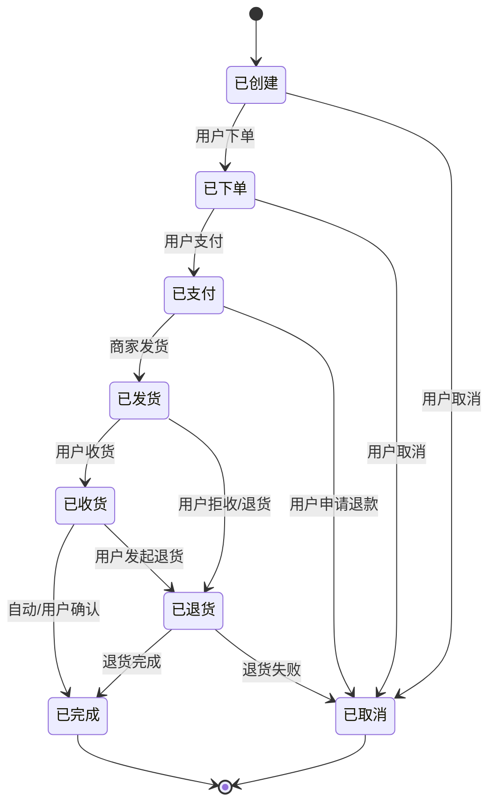

# 订单状态设计文档

## 1. 订单状态定义

| 状态     | 含义说明                 |
|----------|--------------------------|
| 已创建   | 订单已生成，待下单       |
| 已下单   | 用户已确认下单，待支付   |
| 已支付   | 用户已完成支付，待发货   |
| 已取消   | 订单已被取消，流程终止   |
| 已发货   | 商家已发货，待收货       |
| 已收货   | 用户已确认收货，待评价/售后 |
| 已退货   | 用户发起退货，待处理     |
| 已完成   | 订单流程全部结束         |

## 2. 订单状态流转图



## 3. 订单状态类图

```mermaid
classDiagram
    class Order {
        +String id
        +OrderStatus status
        +create()
        +placeOrder()
        +pay()
        +cancel()
        +ship()
        +receive()
        +returnOrder()
        +complete()
    }
    enum OrderStatus {
        已创建
        已下单
        已支付
        已取消
        已发货
        已收货
        已退货
        已完成
    }
    Order --> OrderStatus
``` 