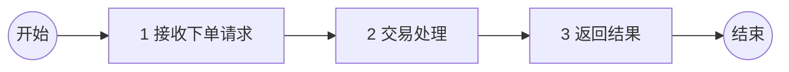
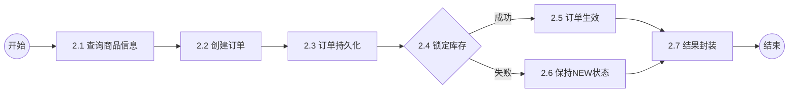
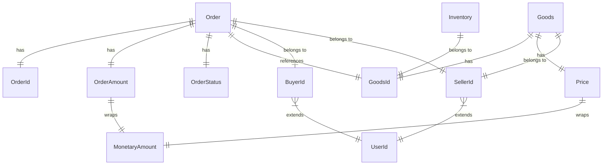
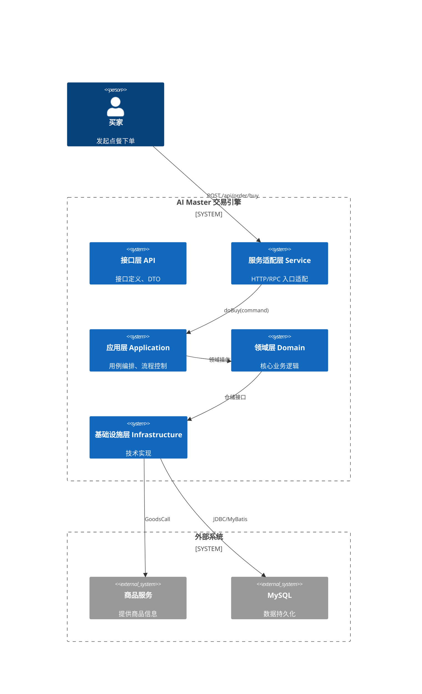

# 架构设计说明书 (ADD)

## 文档信息

| 属性 | 值 |
|------|-----|
| 版本 | 2.0 (逆向整理增强版) |
| 更新日期 | 2026-02-12 |

## 一、业务分析

### 1. 名词定义

| 名词 | 含义 | 举例 |
|------|------|------|
| 聚合根 (Aggregate Root) | DDD 中管理聚合内所有对象生命周期的根实体 | `Order`, `Goods` |
| 值对象 (Value Object) | 无唯一标识，通过属性值判等的不可变对象 | `OrderId`, `Price`, `MonetaryAmount` |
| 领域服务 (Domain Service) | 处理不属于单个聚合的业务逻辑 | `OrderDomainService`, `InventoryDomainService` |
| 应用服务 (Application Service) | 编排领域对象完成业务用例，控制事务边界 | `OrderApplicationService` |
| Action | 应用层的原子业务步骤单元 | `OrderCreateAction`, `InventoryLockAction` |
| Command | CQS 模式下的写操作输入对象 | `OrderBuyCommand` |
| Result | 应用层输出对象 | `OrderBuyResult` |
| Facade | 领域层的查询入口（封装仓储查询） | `ItemQueryFacade`, `OrderQueryFacade` |
| Provider | 服务适配层的 RPC 接口实现 | `OrderServiceProvider` |
| `@Call` | Transformer 框架的方法级调用日志与性能监控注解 | `@Call(elapsed=1200, sample=10000)` |

### 2. 业务流程

#### 主流程



| 编码 | 业务流程 | 职责 | 输入 | 输出 |
|------|---------|------|------|------|
| 1 | 接收下单请求 | 参数校验、DTO→Command 转换 | OrderBuyRequest | OrderBuyCommand |
| 2 | 交易处理 | 创建订单、锁定库存、订单生效 | OrderBuyCommand | OrderBuyResult |
| 3 | 返回结果 | Result→Response/DTO 转换 | OrderBuyResult | OrderBuyResponse |

#### 子流程：交易处理



| 编码 | 业务活动 | 职责 | 输入 | 输出 |
|------|---------|------|------|------|
| 2.1 | 查询商品信息 | 通过 `ItemQueryFacade` 查询（@Cacheable） | goodsId | Goods |
| 2.2 | 创建订单 | `Order.create()` 工厂方法，计算金额 | BuyerId, Goods, count | Order (NEW) |
| 2.3 | 订单持久化 | `OrderRepository.create()` 插入数据库 | Order | Order (含 orderId) |
| 2.4 | 锁定库存 | `InventoryDomainService.lock()` | GoodsId, lock | boolean |
| 2.5 | 订单生效 | `order.enable()` → NEW→CREATED | Order | Order (CREATED) |
| 2.6 | 保持 NEW 状态 | 库存不足时不变更订单状态 | Order | Order (NEW) |
| 2.7 | 结果封装 | `OrderBuyResultFactory` MapStruct 映射 | Order | OrderBuyResult |

### 3. 领域模型

#### 领域对象

| 领域对象 | DDD 类型 | 职责 | 关键属性 |
|----------|---------|------|----------|
| `Order` | 聚合根 | 订单一致性边界，工厂创建+状态机 | orderId, goodsId, buyerId, sellerId, itemCount, amount, status |
| `Goods` | 聚合根 | 商品信息与价格计算 | goodsId, title, price, sellerId |
| `Inventory` | 值对象 | 库存管理（锁定/扣减/回退） | goodsId, available, locked, sold, lock |
| `OrderId` | 值对象 | 订单唯一标识 | id (Long, >0) |
| `OrderAmount` | 值对象 | 订单金额封装 | amount (MonetaryAmount) |
| `OrderStatus` | 枚举 | 订单状态机 (7种状态) | NEW→CREATED→PAID→... |
| `Price` | 值对象 | 商品单价，含溢出检查 | amount (MonetaryAmount) |
| `MonetaryAmount` | 值对象 | 不可变金额 (元/分双单位，支持折扣/加减) | monetaryAmount (BigDecimal), scale |
| `BuyerId`/`SellerId` | 值对象 | 用户标识 | 继承 UserId → Id |
| `OrderCreatedEvent` | 领域事件 | 订单创建事件（已定义未使用） | 继承 OrderEvent |

#### 对象关系



## 二、概要设计

### 1. 系统应用架构



#### 系统职责边界

| 系统名称 | 主要职责 | 边界说明 |
|---------|---------|---------|
| 接口层 (api) | 定义服务契约 (接口 + DTO + Request/Response) | 不含任何实现逻辑 |
| 服务适配层 (service) | 接收外部请求，参数校验，DTO↔Command 转换 | 不含业务逻辑，仅协议适配 |
| 应用层 (application) | 用例编排，协调多个 Action 完成业务流程 | 不实现业务规则，只编排 |
| 领域层 (domain) | 核心业务逻辑，实体、值对象、领域服务 | 不依赖任何技术框架 (除 Spring 注解) |
| 基础设施层 (infrastructure) | 仓储实现、数据库访问、外部服务适配 | 实现领域层定义的接口 |

### 2. 分层架构

| 层级 | 模块 | 职责 | 关键组件 | 依赖方向 |
|------|------|------|----------|---------|
| **接口层** | `ai-master-api` | 服务契约定义 | `OrderService`, `OrderBuyRequest`, `OrderBuyResponse`, `OrderBuyDTO` | → common |
| **适配层** | `ai-master-service` | HTTP/RPC 入口 | `OrderController`, `OrderServiceProvider`, `OrderCommandFactory`, `OrderResultFactory` | → api, application |
| **应用层** | `ai-master-application` | 用例编排 | `OrderApplicationService`, `OrderCreateAction`, `InventoryLockAction`, `OrderEnableAction` | → domain |
| **领域层** | `ai-master-domain` | 核心业务 | `Order`, `Goods`, `Inventory`, `OrderDomainService`, `InventoryDomainService` | → common |
| **基础设施层** | `ai-master-infrastructure` | 技术实现 | `OrderDao`, `GoodsDal`, `OrderMapper`, `OrderFactory`, `GoodsFactory` | → domain |
| **启动层** | `ai-master-boot` | 应用启动 | `ApplicationStarter` (Jackson SNAKE_CASE 配置) | → service, infrastructure |

### 3. 能力定义

| API 能力 | 归属层 | 能力说明 | SLA 协议 |
|---------|--------|---------|---------|
| `POST /api/order/buy` | service (OrderController) | 买家下单<br/>入参：buyerId, goodsId, itemCount<br/>出参：OrderBuyResponse | @Call(elapsed=1200ms, sample=10000) |
| `OrderService.buy()` | api (RPC 接口) | RPC 下单<br/>入参：OrderBuyRequest<br/>出参：OrderBuyResponse | @Call(elapsed=1200ms, sample=10000) |
| `OrderApplicationService.doBuy()` | application | 交易编排<br/>入参：OrderBuyCommand<br/>出参：OrderBuyResult | - |
| `ItemQueryFacade.requireGoods()` | domain | 商品查询 (含缓存)<br/>入参：goodsId<br/>出参：Goods | @Cacheable |

### 4. 技术选型

| **VALET** | **考量维度** | **当前方案** | **备注** |
|-----------|------------|------------|---------|
| **Volume (容量)** | 并发流量 | Spring Boot 内嵌 Tomcat | 可水平扩展 |
| | 数据量 | MySQL 单库 | 需关注订单表增长 |
| **Availability (可用性)** | 可用率 | Spring Boot Fat Jar 部署 | 建议容器化+多实例 |
| **Latency (耗时)** | 请求 RT | 商品查询 @Cacheable, @Call 监控 | elapsed=1200ms 告警阈值 |
| | 数据读写 | MyBatis + Druid 连接池 | Druid 1.2.23 |
| **Error (错误率)** | 参数容错 | Bean Validation + 自定义 validator | 双重校验 (HTTP/RPC) |
| | 数据一致性 | 订单创建→库存锁定 (应用层编排) | 缺少分布式事务保障 |
| | 金额安全 | Long 溢出检查 (Price.calculateAmount) | MonetaryAmount 不可变 |
| **Ticket (运维)** | 监控 | Transformer @Call 注解 | 方法级日志与性能采样 |

## 三、数据架构

### 核心表结构 (推测)

| 表名 | 实体 | 字段 | 类型 | 说明 |
|------|------|------|------|------|
| `order` | OrderEntity | id | BIGINT PK | 自增主键，映射为 OrderId |
| | | goods_id | BIGINT | 商品 ID |
| | | buyer_id | BIGINT | 买家 ID |
| | | seller_id | BIGINT | 卖家 ID |
| | | amount | BIGINT | 订单金额 (单位：分) |
| | | status | INT | 订单状态 (参见 OrderStatus 枚举) |
| `goods` | GoodsEntity | id | BIGINT PK | 商品 ID |
| | | title | VARCHAR | 商品标题 |
| | | price | INT | 商品单价 (单位：分) |

### 数据流图

```mermaid
flowchart TD
    Client[客户端] -->|HTTP/RPC| Controller[OrderController/Provider]
    Controller -->|Command| AppService[OrderApplicationService]
    AppService -->|查询| GoodsFacade[ItemQueryFacade]
    GoodsFacade -->|@Cacheable| GoodsDal[GoodsDal]
    GoodsDal -->|GoodsCall| ExtService[外部商品服务]
    AppService -->|创建| OrderDomain[OrderDomainService]
    OrderDomain -->|持久化| OrderDao[OrderDao]
    OrderDao -->|MyBatis| DB[(MySQL)]
    AppService -->|锁定| InvDomain[InventoryDomainService]
    InvDomain -->|持久化| InvRepo[InventoryRepository]
    InvRepo -->|MyBatis| DB
```

## 四、集成点

| 外部系统 | 集成方式 | 接口 | 用途 |
|---------|---------|------|------|
| MySQL | JDBC / MyBatis | OrderMapper.insert/enable | 订单数据持久化 |
| 商品服务 | RPC / Interface (GoodsCall) | GoodsCall.getGoodsById | 商品信息获取 |
| Transformer | Jar 依赖 | @Call, BeanHelper, Result, Request | 通用框架支持 |

## 五、部署架构

- **构建**: Maven 多模块，`mvn clean package -DskipTests`
- **运行**: `java -jar ai-master-boot/target/ai-master-boot.jar`
- **环境**: JDK 17+, Maven 3.8+, MySQL 5.7+
- **配置**: `ai-master-boot/src/main/resources/application.properties`
- **进程管理**: PID 文件 `app.pid`

## 六、详设文档

| 主流程编号 | 主流程名称 | 详细设计文档 |
|-----------|-----------|------------|
| 1 | 接收下单请求 | 参见 Service 层 `OrderController` / `OrderServiceProvider` |
| 2 | 交易处理 | 参见 Application 层 `OrderApplicationService.doBuy()` |
| 3 | 返回结果 | 参见 Service 层 `OrderResultFactory` / `OrderBuyDTOFactory` |
