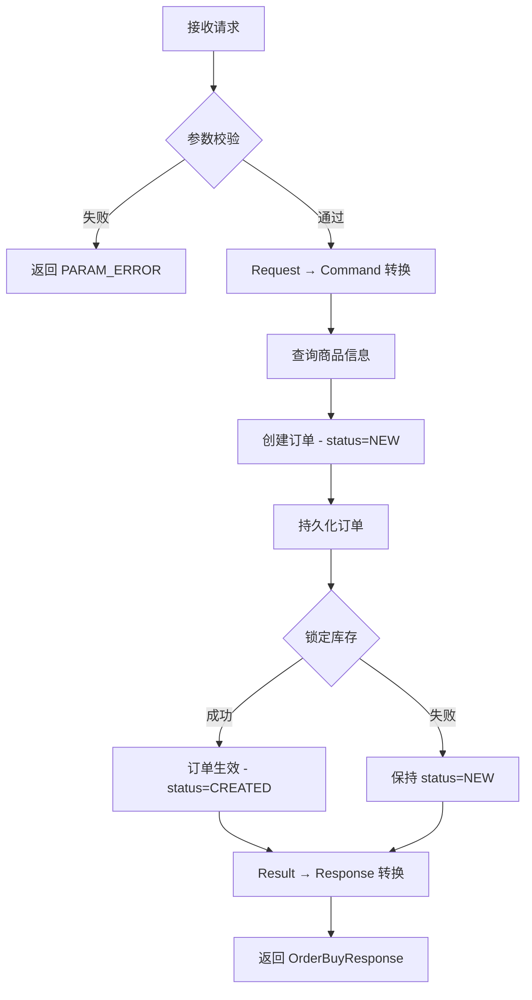

# API 文档

> 版本: 2.0 | 更新日期: 2026-02-12

## 概述

AI Master Restaurant Order 系统提供 **双入口** API 接入方式:

| 入口方式 | 实现类 | 协议 | 基础路径 |
|---------|--------|------|---------|
| HTTP REST | `OrderController` | HTTP POST | `/api/order` |
| RPC | `OrderServiceProvider` | RPC (Dubbo/自定义) | `OrderService` 接口 |

**全局约定**:
- 请求/响应 JSON 命名策略: **SNAKE_CASE** (如 `buyer_id`, `goods_id`)
- 空值字段不序列化 (`NON_NULL`)
- 日期格式: `yyyy-MM-dd HH:mm:ss`
- 性能监控: `@Call(elapsed=1200ms, sample=10000)`

---

## 交易模块 (Order)

### 1. 下单购买

创建订单并锁定库存。

#### 基本信息

| 属性 | 值 |
|------|-----|
| **HTTP 端点** | `POST /api/order/buy` |
| **RPC 方法** | `OrderService.buy(OrderBuyRequest)` |
| **服务实现** | `OrderController` / `OrderServiceProvider` |
| **应用服务** | `OrderApplicationService.doBuy()` |
| **SLA** | elapsed=1200ms, sample=10000 |

#### 请求 (OrderBuyRequest)

| 字段 | JSON 键名 | 类型 | 必填 | 校验规则 | 描述 |
|------|----------|------|------|----------|------|
| buyerId | `buyer_id` | Long | ✅ | 非 null, > 0 | 买家 ID |
| goodsId | `goods_id` | Long | ✅ | 非 null, > 0 | 商品 ID |
| itemCount | `item_count` | Integer | ✅ | 非 null, > 0 | 购买数量 |

**请求示例**:
```json
{
  "buyer_id": 10001,
  "goods_id": 2001,
  "item_count": 3
}
```

**参数校验**:
- HTTP 端: 使用 `@Valid` + `BindingResult` Bean Validation
- RPC 端: 使用 `OrderBuyRequest.validator()` 方法
- **注意**: `validator()` 返回 `true` 表示参数**无效** (语义反转)

#### 响应 (OrderBuyResponse)

继承 `com.transformer.response.Result<OrderBuyDTO>` 基类。

| 字段 | JSON 键名 | 类型 | 描述 |
|------|----------|------|------|
| success | `success` | Boolean | 请求是否成功 |
| statusCode | `status_code` | String | 错误码 (失败时) |
| message | `message` | String | 错误信息 (失败时) |
| module | `module` | OrderBuyDTO | 业务数据 (成功时) |

**OrderBuyDTO 内部字段** (当前为空类，建议扩展):

> ⚠️ `OrderBuyDTO` 目前未定义任何字段，以下为建议字段 (基于 `OrderBuyResult`):

| 建议字段 | 类型 | 描述 |
|---------|------|------|
| orderId | Long | 订单 ID |
| goodsId | Long | 商品 ID |
| buyerId | Long | 买家 ID |
| sellerId | Long | 卖家 ID |
| itemCount | Integer | 购买数量 |
| amount | Long | 订单金额 (单位：分) |
| status | Integer | 订单状态 (0=NEW, 1=CREATED) |

**成功响应示例**:
```json
{
  "success": true,
  "status_code": null,
  "message": null,
  "module": {
    "order_id": 100001,
    "goods_id": 2001,
    "buyer_id": 10001,
    "seller_id": 5001,
    "item_count": 3,
    "amount": 3000,
    "status": 1
  }
}
```

**失败响应示例**:
```json
{
  "success": false,
  "status_code": "PARAM_ERROR",
  "message": "参数验证失败"
}
```

#### 业务逻辑



#### 错误码

| 错误码 | 描述 | 触发条件 |
|--------|------|----------|
| `PARAM_ERROR` | 参数验证失败 | buyerId/goodsId/itemCount 缺失或无效 |
| `IllegalStateException` | 订单状态异常 | 非 NEW 状态调用 enable |
| `IllegalArgumentException` | 金额溢出 | 商品单价 × 数量超出 Long 上限 |

---

## 内部对象转换链

```
OrderBuyRequest (api)
    ↓ OrderCommandFactory.asCommand() [BeanHelper]
OrderBuyCommand (application)
    ↓ OrderApplicationService.doBuy()
Order (domain)
    ↓ OrderBuyResultFactory.toResult() [MapStruct]
OrderBuyResult (application)
    ↓ OrderBuyDTOFactory.toDTO() [MapStruct]
OrderBuyDTO (api)
    ↓ OrderBuyResponse.success(dto)
OrderBuyResponse (api)
```

---

## API 清单总览

| # | 端点 | 方法 | 描述 | 状态 |
|---|------|------|------|------|
| 1 | `POST /api/order/buy` | HTTP | 下单购买 | ✅ 已实现 |
| 2 | `OrderService.buy()` | RPC | 下单购买 | ✅ 已实现 |
| 3 | 订单查询 | - | 查询订单详情 | ⬜ 占位 (`OrderQueryFacade` 返回 null) |
| 4 | 订单支付 | - | 支付订单 | ⬜ 未实现 |
| 5 | 订单状态变更 | - | 取消/退款/确认等 | ⬜ 未实现 |

---

## 接口代码索引

| 组件 | 文件 | 职责 |
|------|------|------|
| 接口定义 | [OrderService.java](../ai-master-api/src/main/java/com/only/ai/master/order/api/OrderService.java) | RPC 服务接口 |
| 请求类 | [OrderBuyRequest.java](../ai-master-api/src/main/java/com/only/ai/master/order/api/module/request/OrderBuyRequest.java) | 下单请求 DTO |
| 响应类 | [OrderBuyResponse.java](../ai-master-api/src/main/java/com/only/ai/master/order/api/module/response/OrderBuyResponse.java) | 下单响应 DTO |
| DTO | [OrderBuyDTO.java](../ai-master-api/src/main/java/com/only/ai/master/order/api/module/dto/OrderBuyDTO.java) | 业务数据 DTO (空类) |
| HTTP 控制器 | [OrderController.java](../ai-master-service/src/main/java/com/only/ai/master/order/service/web/controller/OrderController.java) | HTTP REST 入口 |
| RPC 实现 | [OrderServiceProvider.java](../ai-master-service/src/main/java/com/only/ai/master/order/service/rpc/OrderServiceProvider.java) | RPC 入口 |
| 命令工厂 | [OrderCommandFactory.java](../ai-master-service/src/main/java/com/only/ai/master/order/service/factory/OrderCommandFactory.java) | Request → Command |
| 结果工厂 | [OrderResultFactory.java](../ai-master-service/src/main/java/com/only/ai/master/order/service/factory/OrderResultFactory.java) | Result → Response |
| DTO 工厂 | [OrderBuyDTOFactory.java](../ai-master-service/src/main/java/com/only/ai/master/order/service/factory/OrderBuyDTOFactory.java) | Result → DTO (MapStruct) |
