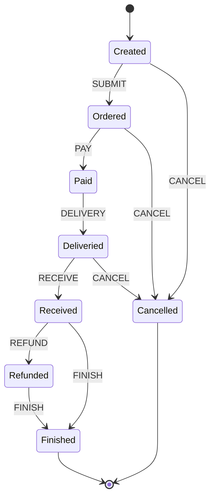
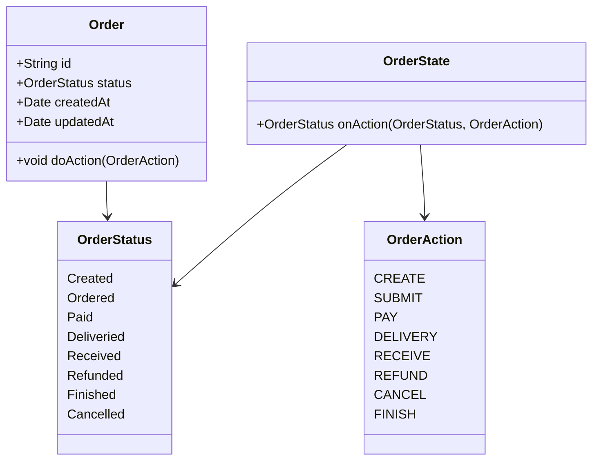

# 订单状态机结构化设计

## 1. 设计目标与原则
- 明确订单全生命周期的状态与动作，支持灵活扩展
- 用"当前状态+订单动作=下一状态"结构化表达流转规则
- 采用面向对象设计，状态与动作均为类，便于扩展和封装行为
- 终止状态（Finished、Cancelled）明确指向流程终结

## 2. 状态与动作定义

### 订单状态（OrderStatus）
- Created：已创建，订单生成但未下单
- Ordered：已下单，等待支付
- Paid：已支付，等待发货
- Deliveried：已发货，等待收货
- Received：已收货，等待完成或退款
- Refunded：已退款，售后流程
- Finished：已完成，订单流程终止
- Cancelled：已取消，订单流程终止

### 订单动作（OrderAction）
- CREATE：创建订单
- SUBMIT：下单
- PAY：支付
- DELIVERY：发货
- RECEIVE：收货
- REFUND：退款
- CANCEL：取消
- FINISH：完成

## 3. 状态流转规则

订单状态流转由OrderState类统一管理，核心规则如下：

| 当前状态   | 订单动作 | 下一状态   |
|------------|----------|------------|
| Created    | SUBMIT   | Ordered    |
| Ordered    | PAY      | Paid       |
| Ordered    | CANCEL   | Cancelled  |
| Created    | CANCEL   | Cancelled  |
| Paid       | DELIVERY | Deliveried |
| Deliveried | RECEIVE  | Received   |
| Deliveried | CANCEL   | Cancelled  |
| Received   | REFUND   | Refunded   |
| Received   | FINISH   | Finished   |
| Refunded   | FINISH   | Finished   |

- 终止状态：Finished、Cancelled
- 终止状态不可再流转

## 4. 状态说明

- **Created**：订单已生成，尚未下单，可取消或下单
- **Ordered**：已下单，等待支付，可支付或取消
- **Paid**：已支付，等待发货
- **Deliveried**：已发货，等待收货，可收货或取消
- **Received**：已收货，可完成或退款
- **Refunded**：已退款，等待完成
- **Finished**：订单流程终止（正常完成）
- **Cancelled**：订单流程终止（取消）

## 5. 状态流转图（Mermaid）

## 6. 关键类设计与类图

- Order：订单实体，持有当前状态
- OrderStatus：订单状态，类实现，支持扩展
- OrderAction：订单动作，类实现，支持扩展
- OrderState：状态机，onAction方法实现状态迁移

