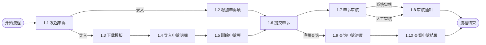
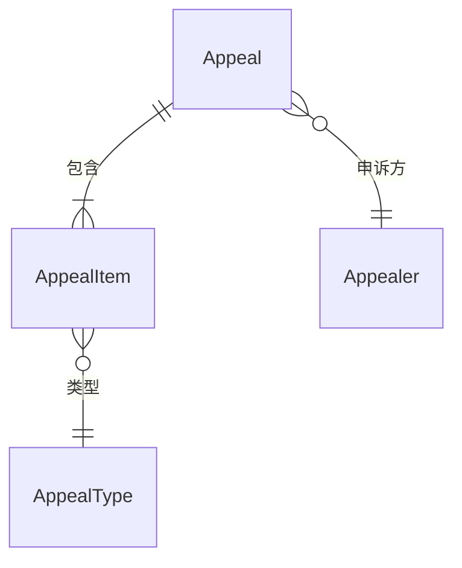
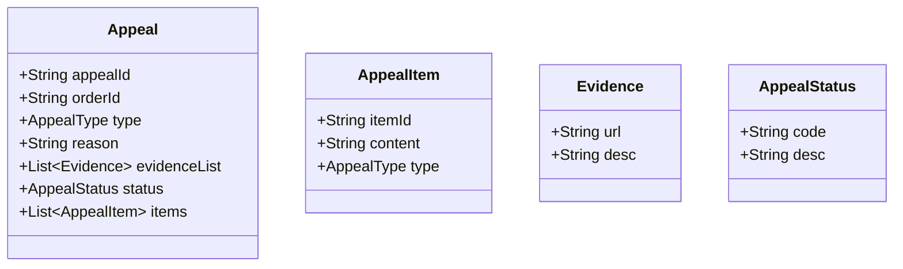
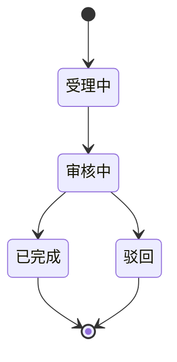
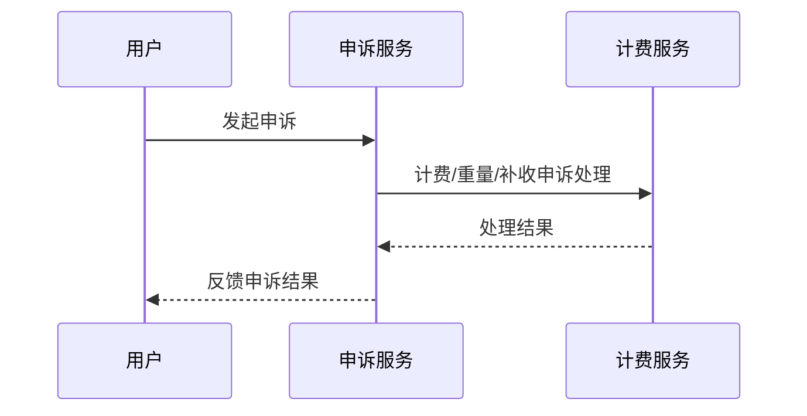
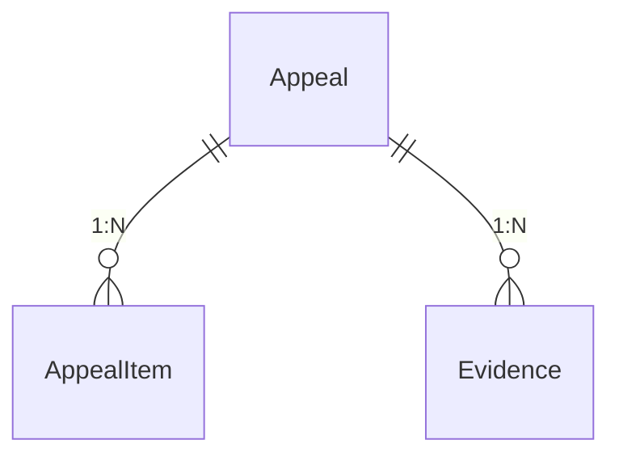

# 申诉详细设计

## 一、业务分析

### 1. 名词定义
|名词|含义|举例|
|-----|-----|---|
| 申诉单 | 记录并管理用户发起的所有申诉事项的聚合根对象 | 某用户发起一条申诉，系统生成一条申诉记录 |
| 申诉项 | 申诉单下具体的申诉明细，支持多类型申诉 | 一条申诉单下有多个申诉项，分别可以申诉不同类型 |
| 申诉类型 | 申诉项的类型及名称，区分不同申诉业务 | 费用、重量、目的地申诉等类型 |
| 申诉方 | 发起申诉的主体，可为网点、中心等 | 网点A、中心C作为申诉方发起申诉 |

### 2. 业务流程
- 业务流程严格对应架构图数字编码，体现申诉全流程主要节点。



### 3. 领域模型
- 采用领域驱动设计（DDD），申诉单为聚合根，关联申诉项、申诉方、申诉理由、申诉状态、附件等。

|领域对象|对象类型|对象属性|
|---|---|---|
|Appeal（申诉单）|聚合根|id、appealerId（申诉方id）、reason（申诉理由）、status（申诉状态）、attachments（附件列表）、items（申诉项列表）|
|AppealItem（申诉项）|实体|id、type（申诉类型）、title（申诉项标题）、status（申诉项状态）、content（申诉内容）|
|AppealType（申诉类型）|值对象|type（申诉类型）、title（申诉类型名）|
|Appealer（申诉方）|实体|id、code（申诉方编码）、type（申诉方类型）|



### 4. 能力定义
|流程节点|归属系统|接口/Topic|
|---|---|---|
|1.1 发起申诉|申诉服务|/api/appeal/create|
|1.2 增加申诉项|申诉服务|/api/appeal/item/add|
|1.3 下载模板|文件存储/申诉服务|/api/appeal/template/download|
|1.4 导入申诉明细|申诉服务|/api/appeal/item/import|
|1.5 删除申诉项|申诉服务|/api/appeal/item/delete|
|1.6 提交申诉|申诉服务|/api/appeal/submit|
|1.7 申诉审核|申诉服务|/api/appeal/audit|
|1.8 审核通知|申诉服务/MQ|policy_appeal_event_topic|
|1.9 查询申诉进展|申诉服务|/api/appeal/progress|
|1.10 查看申诉结果|申诉服务|/api/appeal/query|

## 二、详细设计

### 1. 容器架构
#### 服务划分
- 申诉APP（前端）：提供用户申诉入口、申诉项管理、进度与结果查询等界面，基于Vue/React实现。
- 申诉服务：负责申诉单全生命周期管理、流程编排、状态流转、审核处理，基于Spring Boot实现。
- 文件存储：用于存储申诉相关的附件、模板等文件，支持文件上传、下载、读取。
- 申诉数据库：持久化存储申诉单、申诉项等核心业务数据，采用MySQL。
- 申诉通知（MQ）：通过RocketMQ实现申诉归档、审核通知等异步消息推送。
- 收单服务：对接收单/计费相关业务，提供凭证查询、计费申诉等能力。

#### 外部依赖
- 文件存储：用于申诉材料、模板等文件的上传与下载。
- MQ（RocketMQ）：实现申诉归档、审核通知等异步消息推送。
- 收单服务：提供计费、凭证等外部业务能力对接。

#### 架构图
> 调用采用三位数字编码，例如a.b.c.，第一位a代表业务流程，第二位b代表业务活动，第三位c代表业务步骤，均按照顺序编排


### 2. API设计
> 所有接口遵循RESTful风格，接口参数与响应结构清晰，异常处理与SLA协议明确。

|API事项|具体说明|
|----|----|
|API签名|`/api/appeal/create`|
|请求参数|`{"orderId":"","appealType":"计费/重量/补收","reason":"","evidence":[]}`|
|响应结果|`{"appealId":"","status":"受理中"}`|
|关键步骤|- 1.1.1 校验订单<br/>- 1.1.2 校验申诉类型<br/>- 1.1.3 受理申诉|
|状态和异常|400、500|
|SLA协议|99.95%成功率|

|API事项|具体说明|
|----|----|
|API签名|`/api/appeal/query`|
|请求参数|`{"appealId":""}`|
|响应结果|`{"appealId":"","status":"审核中/已完成/驳回","result":""}`|
|关键步骤|- 2.1.1 查询申诉单<br/>- 2.1.2 返回状态|
|状态和异常|404、500|
|SLA协议|99.95%成功率|

### 3. 逻辑模型
#### 关键类图

#### 状态流转

#### 处理时序


### 4. 数据模型
#### ER关系

#### 表结构
```sql
CREATE TABLE `appeal` (
    `id` bigint NOT NULL,
    `order_id` bigint NOT NULL,
    `type` varchar(20) NOT NULL,
    `reason` varchar(255),
    `status` varchar(20) NOT NULL,
    PRIMARY KEY (`id`)
);
CREATE TABLE `appeal_item` (
    `id` bigint NOT NULL,
    `appeal_id` bigint NOT NULL,
    `content` varchar(255),
    `type` varchar(20),
    PRIMARY KEY (`id`)
);
CREATE TABLE `evidence` (
    `id` bigint NOT NULL,
    `appeal_id` bigint NOT NULL,
    `url` varchar(255),
    `desc` varchar(255),
    PRIMARY KEY (`id`)
);
``` 