# 申诉详细设计

## 一、业务分析

### 1. 名词定义
> 定义名词，介绍名词含义和案例

|名词|含义|举例|
|-----|-----|---|
| 申诉单 | 记录并管理用户发起的所有申诉事项的聚合根对象 | 某用户发起一条申诉，系统生成一条申诉记录 |
| 申诉项 | 申诉单下具体的申诉明细，支持多类型申诉 | 一条申诉单下有多个申诉项，分别可以申诉不同类型 |
| 申诉类型 | 申诉项的类型及名称，区分不同申诉业务 | 费用、重量、目的地申诉等类型 |
| 申诉方 | 发起申诉的主体，可为网点、中心等 | 网点A、中心C作为申诉方发起申诉 |

### 2. 业务流程
> 表达业务流程流转，每个节点均为业务活动

- 业务流程严格对应架构图数字编码，体现申诉全流程主要节点。

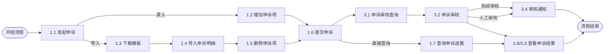

### 3. 领域模型
> 采用领域驱动设计（DDD），用关键对象的ER图表达对象/实体关系

|领域对象|对象类型|对象属性|
|---|---|---|
|Appeal（申诉单）|聚合根|id、appealerId（申诉方id）、reason（申诉理由）、status（申诉状态）、attachments（附件列表）、items（申诉项列表）|
|AppealItem（申诉项）|实体|id、type（申诉类型）、code（申诉项编码）、title（申诉项标题）、status（申诉项状态）、content（申诉内容）|
|AppealType（申诉类型）|值对象|type（申诉类型）、title（申诉类型名）|
|Appealer（申诉方）|实体|id、code（申诉方编码）、type（申诉方类型）|

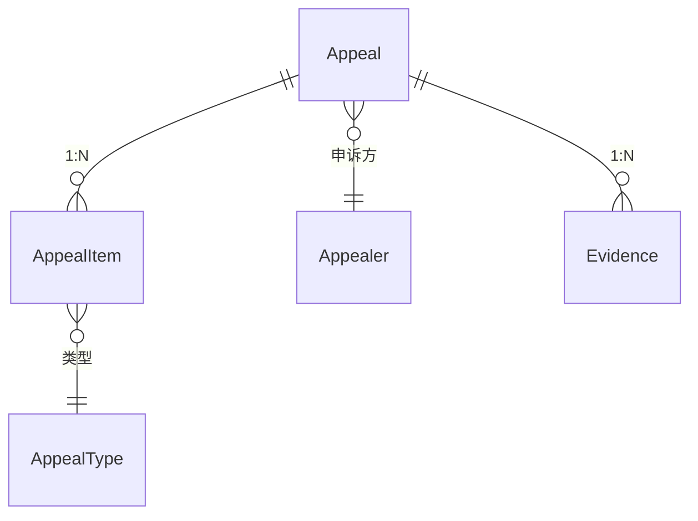

### 4. 能力定义
> 定义支撑业务活动的能力，明确能力归属的系统，以及能力的功能说明（包括关键出入参）

|业务活动|归属系统|能力说明|SLA协议|
|---|---|---|---|
|1.1 发起申诉|申诉服务|创建申诉单，录入申诉基础信息（订单号、类型、理由、证据）|TPS 200<br/>TP95 150ms<br/>TP99 300ms|
|1.2 增加申诉项|申诉服务|为申诉单添加申诉项（类型、内容）|TPS 300<br/>TP95 100ms<br/>TP99 200ms|
|1.3 下载模板|申诉服务/文件存储|下载申诉明细导入模板|QPS 100<br/>TP95 150ms<br/>TP99 300ms|
|1.4 导入申诉明细|申诉服务|批量导入申诉项明细（文件上传、校验、入库）|TPS 100<br/>TP95 200ms<br/>TP99 350ms|
|1.5 删除申诉项|申诉服务|删除指定申诉项|TPS 300<br/>TP95 100ms<br/>TP99 200ms|
|1.6 提交申诉|申诉服务|提交申诉单，进入审核流程|TPS 100<br/>TP95 100ms<br/>TP99 250ms|
|3.1 申诉审核查询|申诉服务|查询待审核申诉单及明细|QPS 100<br/>TP95 100ms<br/>TP99 200ms|
|3.2 申诉审核|申诉服务|系统/人工审核申诉单及项，记录审核意见|TPS 150<br/>TP95 100ms<br/>TP99 200ms|
|3.4 审核通知|申诉服务/MQ|申诉审核结果异步通知（MQ推送）|TPS 300<br/>TP95 50ms<br/>TP99 200ms|
|1.7 查询申诉进展|申诉服务|查询申诉单处理进展|QPS 200<br/>TP95 200ms<br/>TP99 400ms|
|1.8/3.3 查看申诉结果|申诉服务|查询申诉单最终审核结果|QPS 300<br/>TP95 150ms<br/>TP99 300ms|

## 二、详细设计

### 1. 容器架构
#### 服务划分
> 介绍分别有那些容器，各容器的职责

- 申诉APP（前端）：提供用户申诉入口、申诉项管理、进度与结果查询等界面，基于Vue/React实现。
- 申诉服务：负责申诉单全生命周期管理、流程编排、状态流转、审核处理，基于Spring Boot实现。
- 文件存储：用于存储申诉相关的附件、模板等文件，支持文件上传、下载、读取。
- 申诉数据库：持久化存储申诉单、申诉项等核心业务数据，采用MySQL。
- 申诉通知（MQ）：通过RocketMQ实现申诉归档、审核通知等异步消息推送。
- 收单服务：对接收单/计费相关业务，提供凭证查询、计费申诉等能力。

#### 外部依赖
> 介绍依赖外部哪些容易

- 文件存储：用于申诉材料、模板等文件的上传与下载。
- 收单服务：提供计费、凭证等外部业务能力对接。

#### 架构图
> Person跟Container的Rel用业务活动
> Container之间的Rel用业务步骤

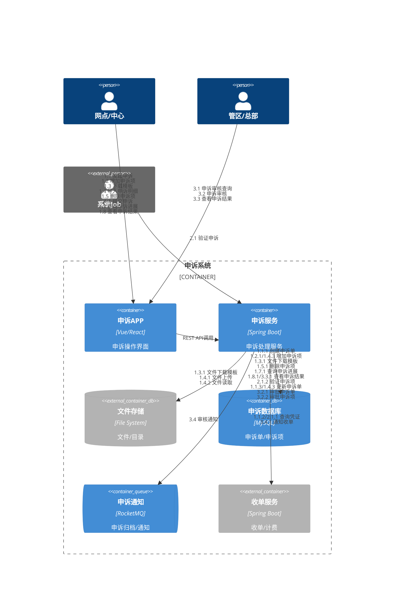

### 2. API设计
> 定义业务活动对应的API，对标####架构图中定义的两位数字编码的业务活动，关键步骤对标三位数字编码的业务步骤
> 所有接口遵循RESTful风格，接口参数与响应结构清晰，异常处理与SLA协议明确。

|API事项|具体说明|
|----|----|
|API名称|1.1 发起申诉|
|API签名|`com.{company}.{business}.appeal.api.AppealService.create`|
|请求参数|`{"reason":"申诉原因", "appealItem":{"appealCode":"申诉项标识","appealType":"重量｜费用","content":{"weigth":2.0, "fee":4.5}}}`|
|响应结果|`{"appealId":"","status":"已受理"}`|
|关键步骤|- 1.1.1 创建申诉单<br/>- 1.1.2 查询凭证<br/>- 1.1.3 更新申诉单|
|状态和异常|400、500|

|API事项|具体说明|
|----|----|
|API名称|1.2 增加申诉项|
|API签名|`com.{company}.{business}.appeal.api.AppealService.addItem`|
|请求参数|`{"appealId":"申诉单id","appealItem":{"appealCode":"申诉项标识","appealType":"重量｜费用","content":{"weigth":2.0, "fee":4.5}}}`|
|响应结果|`{"appealId":"申诉单id","appealItemId":"申诉项id"}`|
|关键步骤|- 1.2.1 增加申诉项|
|状态和异常|400、404、500|

|API事项|具体说明|
|----|----|
|API名称|1.3 下载模板|
|API签名|`com.{company}.{business}.appeal.api.AppealTemplateService.download`|
|请求参数|`{"templateType":""}`|
|响应结果|模板文件流|
|关键步骤|- 1.3.1 文件下载模板|
|状态和异常|404、500|

|API事项|具体说明|
|----|----|
|API名称|1.4 导入申诉明细|
|API签名|`com.{company}.{business}.appeal.api.AppealService.importItems`|
|请求参数|`{"appealId":"申诉单id","file":"文件"}`|
|响应结果|`{"importResult":"success/fail","failItems":[]}`|
|关键步骤|- 1.4.1 文件上传<br/>- 1.4.2 文件读取<br/>- 1.4.3 增加申诉项|
|状态和异常|400、500|

|API事项|具体说明|
|----|----|
|API名称|1.5 删除申诉项|
|API签名|`com.{company}.{business}.appeal.api.AppealService.deleteItem`|
|请求参数|`{"appealId":"申诉单id","appealItemId":"申诉项id"}`|
|响应结果|`{"result":"success/fail"}`|
|关键步骤|- 1.5.1 删除申诉项|
|状态和异常|400、404、500|

|API事项|具体说明|
|----|----|
|API名称|1.6 提交申诉|
|API签名|`com.{company}.{business}.appeal.api.AppealService.submit`|
|请求参数|`{"appealId":""}`|
|响应结果|`{"result":"success/fail","status":"审核中"}`|
|关键步骤|- 1.6.1 提交申诉|
|状态和异常|400、404、500|

|API事项|具体说明|
|----|----|
|API名称|2.1 验证申诉|
|API签名|`com.{company}.{business}.appeal.api.AppealService.validate`|
|请求参数|`{"appealId":"","items":[{"itemId":"","type":"","content":""}]}`|
|响应结果|`{"result":"success/fail","invalidItems":[{"itemId":"","reason":""}]}`|
|关键步骤|- 2.1.1 查询凭证<br/>- 2.1.2 验证申诉项|
|状态和异常|400、404、500|

|API事项|具体说明|
|----|----|
|API名称|1.7 查询申诉进展|
|API签名|`com.{company}.{business}.appeal.api.AppealService.progress`|
|请求参数|`{"appealId":""}`|
|响应结果|`{"progress":[]}`|
|关键步骤|- 1.7.1 查询申诉进展|
|状态和异常|404、500|

|API事项|具体说明|
|----|----|
|API名称|1.8 查看申诉结果/3.1 申诉审核查询/3.3 查看申诉结果|
|API签名|`com.{company}.{business}.appeal.api.AppealService.query`|
|请求参数|`{"status":"待审核/已审核","page":1,"size":20}`|
|响应结果|`{"appeals":[{"appealId":"","appealItems":{"itemId":1,"code":"","type":""},"status":""}],"total":100}`|
|关键步骤|- 3.1.1 查询待审核申诉单|
|状态和异常|400、500|

|API事项|具体说明|
|----|----|
|API名称|3.2 申诉审核|
|API签名|`com.{company}.{business}.appeal.api.AppealService.audit`|
|请求参数|`{"appealId":"","auditOpinion":"","result":"通过/驳回"}`|
|响应结果|`{"result":"success/fail","status":"已完成/驳回"}`|
|关键步骤|- 3.2.1 审批申诉单<br/>- 3.2.2 审批申诉项|
|状态和异常|400、404、500|

|API事项|具体说明|
|----|----|
|API名称|3.4 审核通知|
|Topic|`{business}_appeal_event_topic`|
|请求参数|`{"appealId":"", "approvedItems":[],"rejectedItems":[]}`|
|响应结果|`{"result":"success/fail"}`|
|关键步骤|- 3.4.1 通知收单|
|状态和异常|500|

### 3. 逻辑模型
> 定义领域模型关键类和属性

#### 关键类图
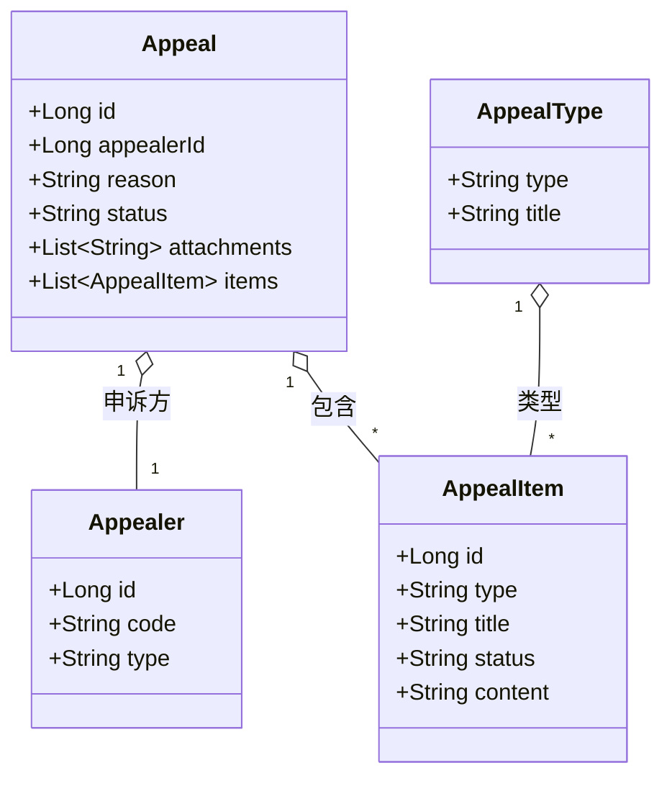
#### 状态流转
> 定义关键对象状态机

##### 申诉单状态机
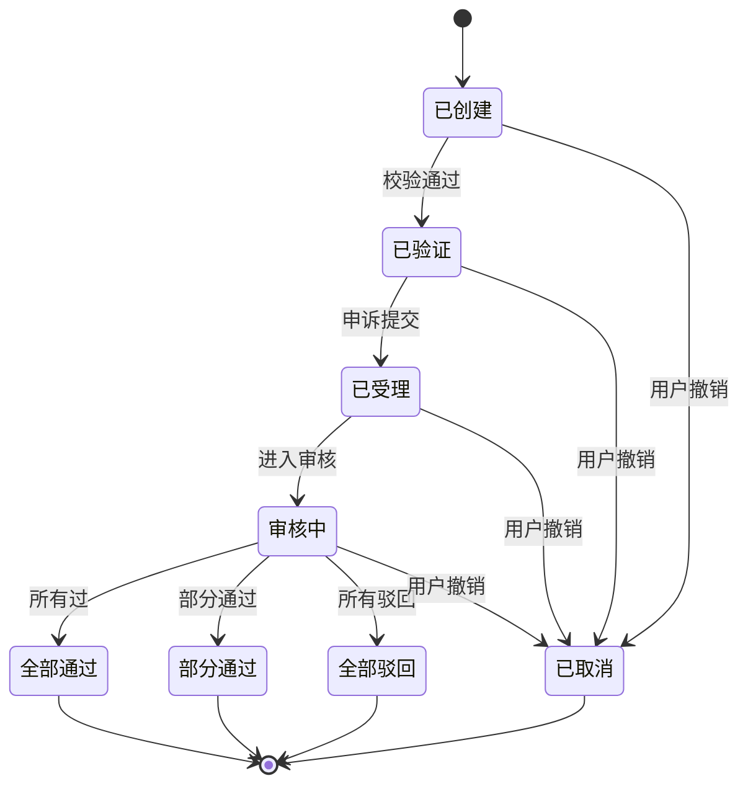
> 说明：  
> - "已创建"是申诉单初始状态，后续经系统校验进入"已验证"，再由受理人确认进入"已受理"。
> - "审核中"可流转为"全部通过""部分通过""全部驳回"三种结果，均可进入"已完成"终态。
> - 用户可在"已创建""已验证""已受理""审核中"任一阶段撤销申诉，进入"已取消"终态。

##### 申诉项状态机

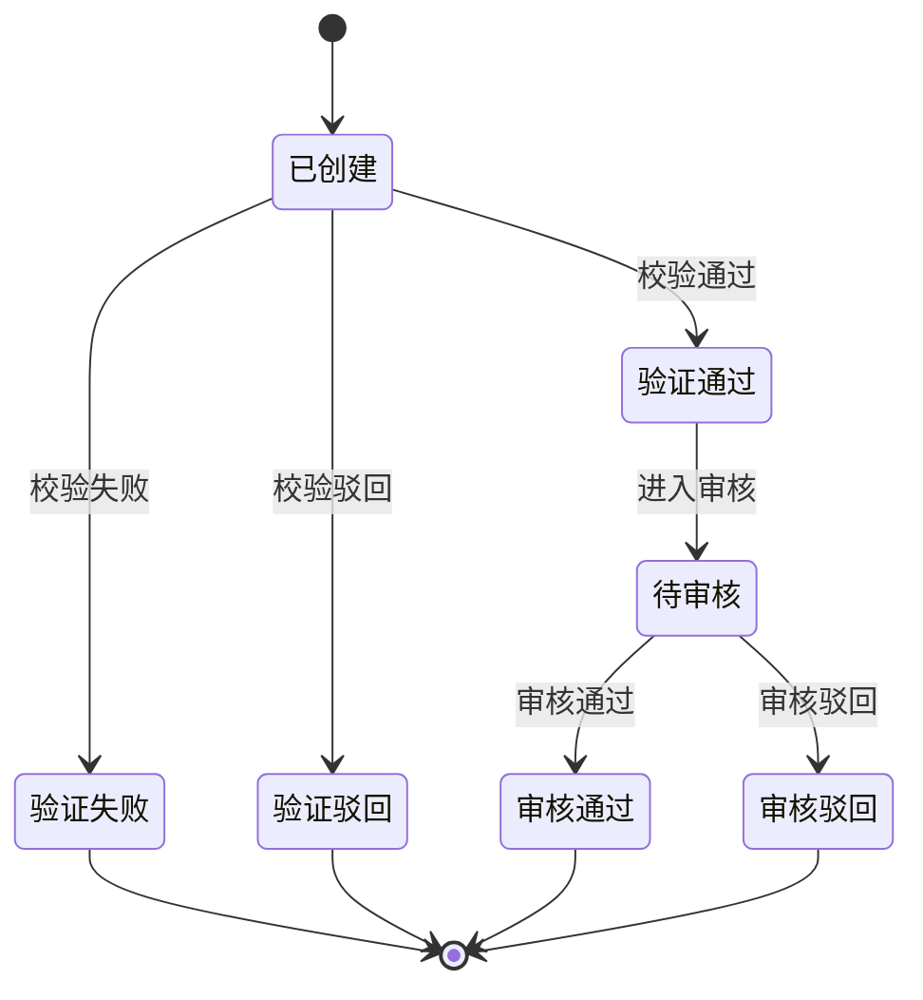
> 说明：  
> - "已创建"为申诉项初始状态，系统校验后可进入"验证通过""验证失败"或"验证驳回"。
> - "验证通过"后进入"待审核"，再由审核流转为"审核通过"或"审核驳回"。
> - "验证失败""验证驳回""审核通过""审核驳回"均为终态。

#### 处理时序
> 参考API设计定义每个API的处理时序，重点突出关键步骤

##### 1.1 发起申诉
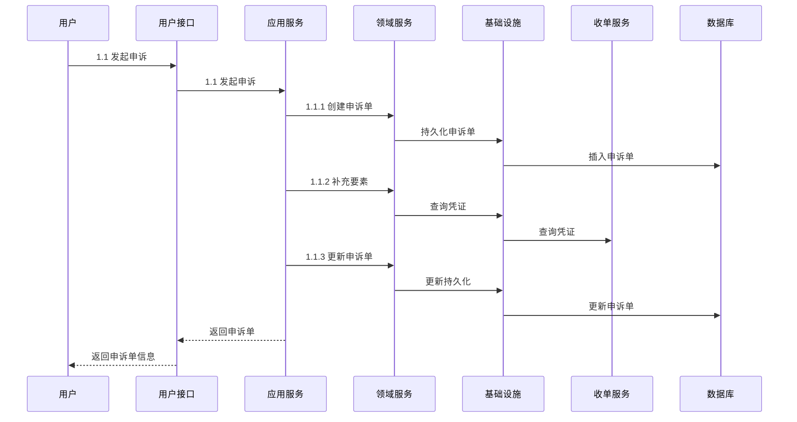

##### 1.2 增加申诉项
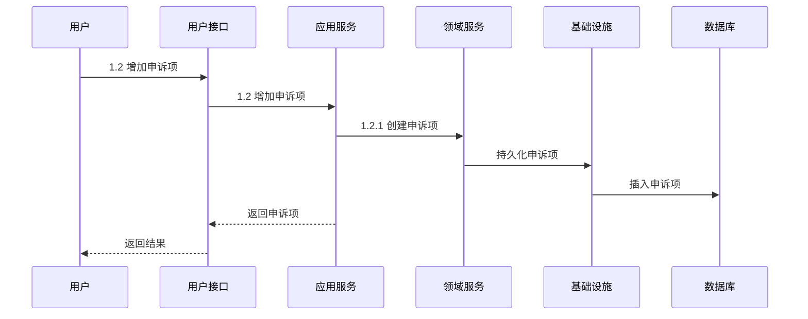

##### 1.3 下载模板
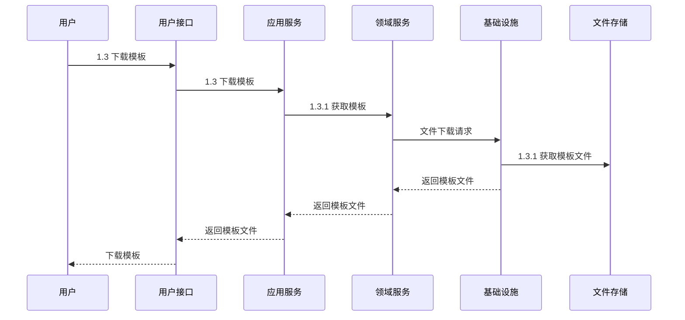

##### 1.4 导入申诉明细
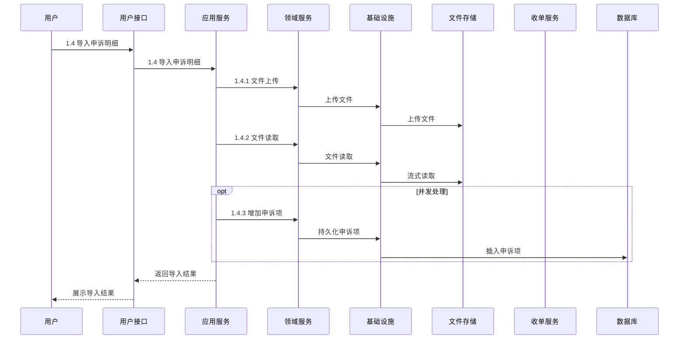

##### 1.5 删除申诉项
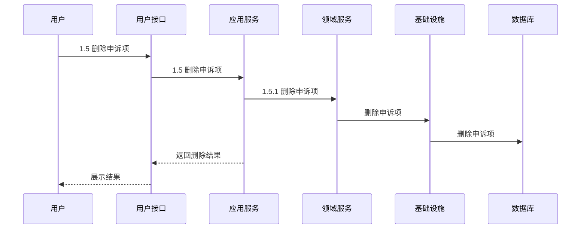

##### 1.6 提交申诉
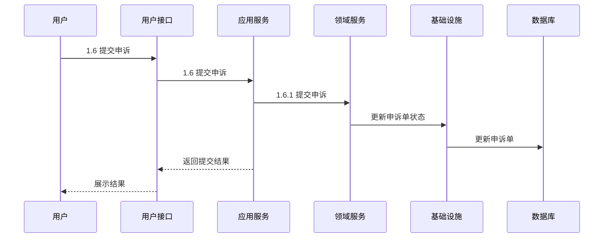

##### 2.1 验证申诉
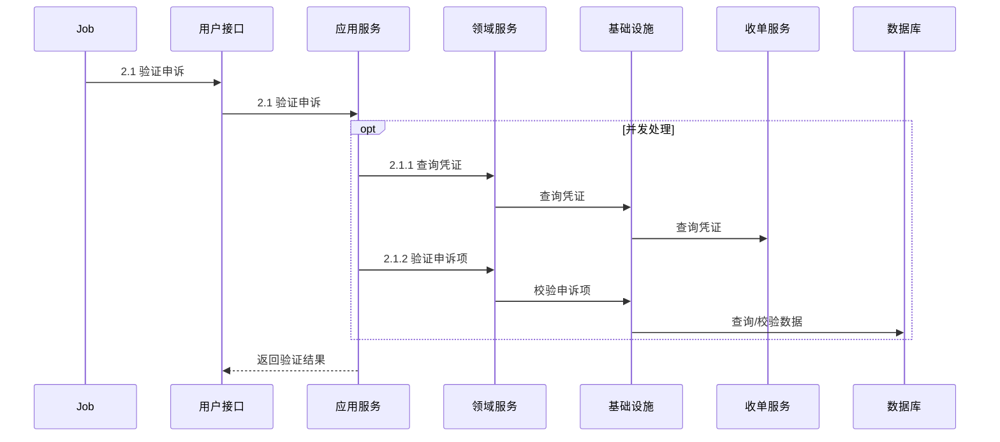

##### 3.1 申诉审核查询
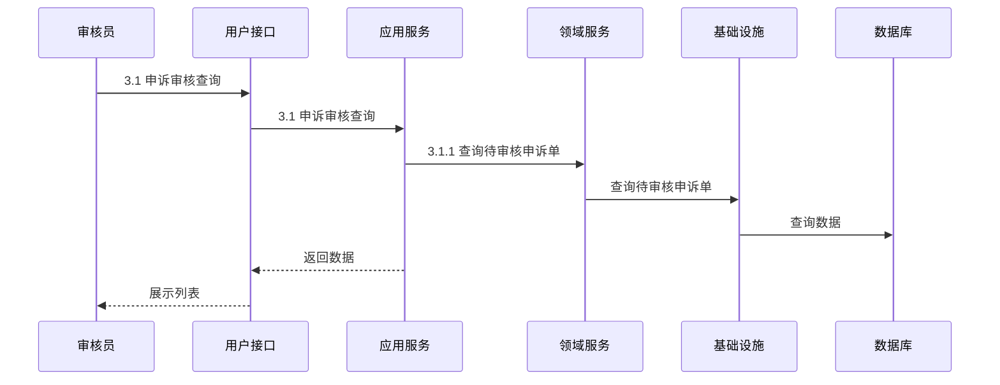

##### 3.2 申诉审核
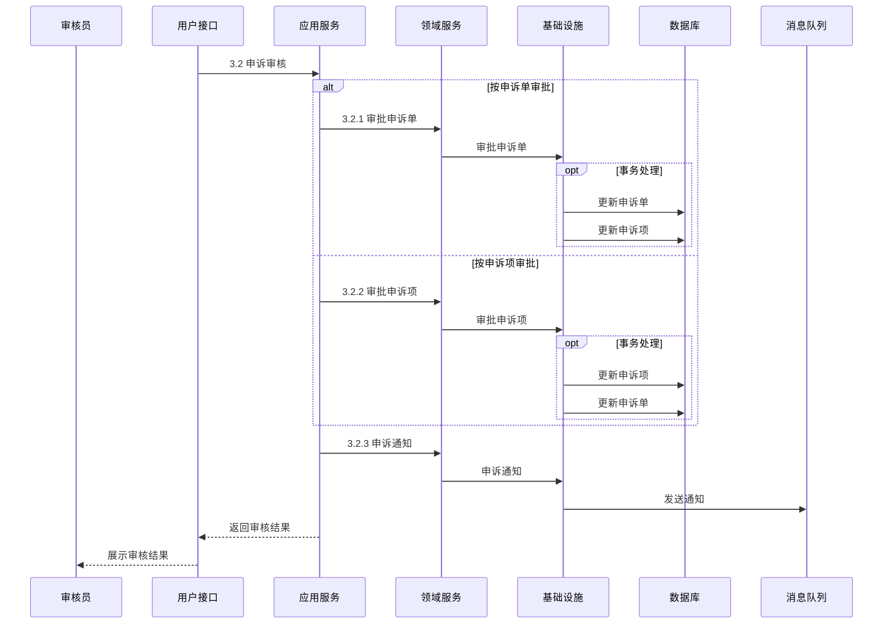

##### 3.3 查看申诉结果
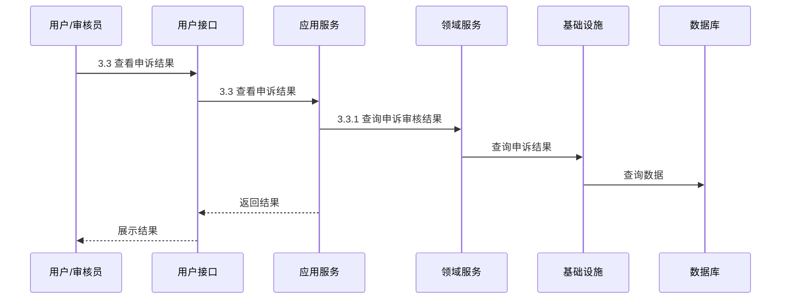

##### 3.4 审核通知
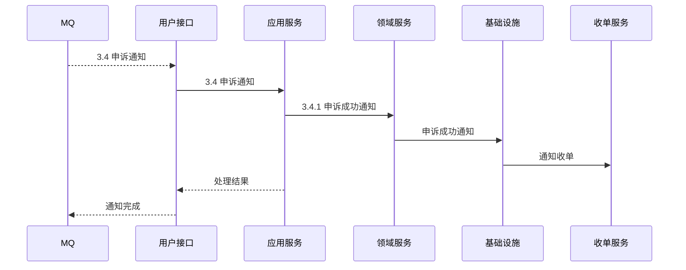

##### 1.7 查询申诉进展


##### 1.8 查看申诉结果


### 4. 数据模型
> 定义主要表的实体关系和表结构

#### ER关系
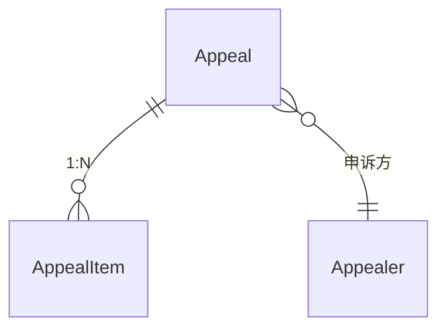

#### 表结构
```sql
-- 申诉单
CREATE TABLE `appeal` (
    `id` bigint NOT NULL PRIMARY KEY COMMENT '申诉单ID',
    `appealer_id` bigint NOT NULL COMMENT '申诉方ID',
    `reason` varchar(255) COMMENT '申诉理由',
    `status` varchar(20) NOT NULL COMMENT '申诉状态',
    `attachments` json COMMENT '附件列表'
);

-- 申诉项
CREATE TABLE `appeal_item` (
    `id` bigint NOT NULL PRIMARY KEY COMMENT '申诉项ID',
    `appeal_id` bigint NOT NULL COMMENT '申诉单ID',
    `type` varchar(20) NOT NULL COMMENT '申诉类型编码',
    `title` varchar(100) COMMENT '申诉项标题',
    `status` varchar(20) NOT NULL COMMENT '申诉项状态',
    `content` varchar(255) COMMENT '申诉内容'
);

-- 申诉方
CREATE TABLE `appealer` (
    `id` bigint NOT NULL PRIMARY KEY COMMENT '申诉方ID',
    `code` varchar(50) NOT NULL COMMENT '申诉方编码',
    `type` varchar(20) NOT NULL COMMENT '申诉方类型'
);
