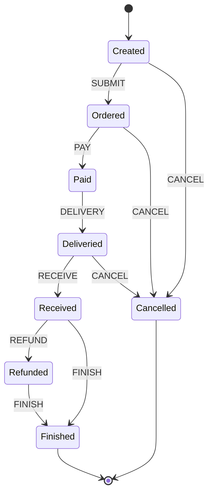
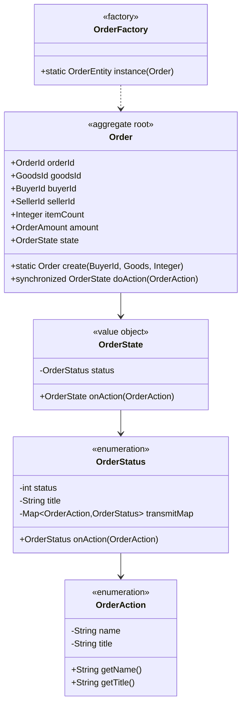

# 订单状态机设计

## 1. 设计目标与原则
- 明确订单全生命周期的状态与动作，支持灵活扩展
- 用"当前状态+订单动作=下一状态"结构化表达流转规则
- 采用面向对象设计，状态与动作均为类，便于扩展和封装行为
- 终止状态（Finished、Cancelled）明确指向流程终结
- 保证状态转换的线程安全和并发控制
- 支持状态转换的可追踪和验证

## 2. 状态与动作定义

### 订单状态（OrderStatus）
- Created(0)：已创建，订单生成但未下单
- Ordered(1)：已下单，等待支付
- Paid(2)：已支付，等待发货
- Deliveried(3)：已发货，等待收货
- Received(4)：已收货，等待完成或退款
- Refunded(5)：已退款，售后流程
- Finished(6)：已完成，订单流程终止
- Cancelled(-1)：已取消，订单流程终止

### 订单动作（OrderAction）
- CREATE：创建订单
- SUBMIT：提交订单
- PAY：支付订单
- DELIVERIED：发货
- RECEIVED：收货
- REFUNDED：退货
- CANCEL：取消订单
- FINISH：完成订单

### 3.4 OrderAction（订单动作）
```java
public enum OrderAction {
    CREATE("CREATE", "创建订单"),      // 创建新订单
    SUBMIT("SUBMIT", "提交订单"),     // 提交订单到系统
    PAY("PAY", "支付订单"),          // 支付订单金额
    DELIVERIED("DELIVERIED", "发货"), // 商家发货
    RECEIVED("RECEIVED", "收货"),     // 买家收货
    REFUNDED("REFUNDED", "退货"),    // 退货处理
    CANCEL("CANCEL", "取消订单"),     // 取消订单
    FINISH("FINISH", "完成订单");     // 完成订单

    private final String name;        // 动作标识
    private final String title;       // 动作描述
}
```

#### 3.4.1 动作语义
1. **CREATE（创建订单）**
   - 触发时机：买家选择商品下单
   - 前置条件：无
   - 后置状态：Created

2. **SUBMIT（提交订单）**
   - 触发时机：买家确认订单信息
   - 前置条件：订单状态为Created
   - 后置状态：Ordered

3. **PAY（支付订单）**
   - 触发时机：买家完成支付
   - 前置条件：订单状态为Ordered
   - 后置状态：Paid

4. **DELIVERIED（发货）**
   - 触发时机：卖家发出商品
   - 前置条件：订单状态为Paid
   - 后置状态：Deliveried

5. **RECEIVED（收货）**
   - 触发时机：买家确认收货
   - 前置条件：订单状态为Deliveried
   - 后置状态：Received

6. **REFUNDED（退货）**
   - 触发时机：买家申请退货
   - 前置条件：订单状态为Received
   - 后置状态：Refunded

7. **CANCEL（取消订单）**
   - 触发时机：买家取消订单
   - 前置条件：订单状态为Created/Ordered/Deliveried
   - 后置状态：Cancelled

8. **FINISH（完成订单）**
   - 触发时机：订单正常完成或退货完成
   - 前置条件：订单状态为Received/Refunded
   - 后置状态：Finished

#### 3.4.2 设计特点
1. 枚举实现
   - 使用枚举类型确保动作的唯一性
   - 每个动作包含标识和描述
   - 支持系统扩展和维护

2. 不可变设计
   - 动作定义后不可修改
   - 确保系统稳定性
   - 便于并发处理

3. 友好展示
   - 重写toString方法
   - 提供动作描述
   - 便于日志记录和界面展示

## 3. 领域模型设计

### 3.1 Order（订单聚合根）
```java
public class Order {
    private OrderId orderId;        // 订单ID（值对象）
    private GoodsId goodsId;        // 商品ID（值对象）
    private BuyerId buyerId;        // 买家ID（值对象）
    private SellerId sellerId;      // 卖家ID（值对象）
    private Integer itemCount;      // 购买数量
    private OrderAmount amount;     // 订单金额（值对象）
    private OrderState state;       // 订单状态（值对象）
    
    // 工厂方法：创建订单
    public static Order create(BuyerId buyerId, Goods goods, Integer itemCount)
    
    // 状态流转方法（线程安全）
    public synchronized OrderState doAction(OrderAction action)
}
```

### 3.2 OrderState（状态封装）
```java
public class OrderState {
    private final OrderStatus status;   // 不可变状态
    
    // 状态转换，返回新的状态对象
    public OrderState onAction(OrderAction action)
}
```

### 3.3 OrderStatus（状态枚举）
```java
public enum OrderStatus {
    private final int status;          // 状态码
    private final String title;        // 状态描述
    private final Map<OrderAction, OrderStatus> transmitMap;  // 状态转换规则
    
    // 状态转换处理
    public OrderStatus onAction(OrderAction action)
    
    // 递归查找可达状态
    private OrderStatus onAction(OrderAction action, Set<OrderStatus> visited)
}
```

## 4. 状态转换实现

### 4.1 状态转换规则
```java
static {
    CREATED.addTransmit(OrderAction.SUBMIT, ORDERED);
    CREATED.addTransmit(OrderAction.CANCEL, CANCELLED);

    ORDERED.addTransmit(OrderAction.PAY, PAID);
    ORDERED.addTransmit(OrderAction.CANCEL, CANCELLED);

    PAID.addTransmit(OrderAction.DELIVERY, DELIVERIED);

    DELIVERIED.addTransmit(OrderAction.RECEIVE, RECEIVED);
    DELIVERIED.addTransmit(OrderAction.CANCEL, CANCELLED);

    RECEIVED.addTransmit(OrderAction.REFUND, REFUNDED);
    RECEIVED.addTransmit(OrderAction.FINISH, FINISHED);

    REFUNDED.addTransmit(OrderAction.FINISH, FINISHED);
}
```

### 4.2 并发控制
- 使用synchronized保证同一订单状态流转的线程安全
- 采用乐观锁控制并发修改
- 状态对象不可变设计，保证线程安全

### 4.3 状态验证
- 检测状态转换循环
- 验证状态转换合法性
- 支持状态可达性分析

## 5. 工厂模式应用

### 5.1 OrderFactory
```java
public class OrderFactory {
    // 领域对象转换为持久化实体
    public static OrderEntity instance(Order order) {
        OrderEntity entity = new OrderEntity();
        entity.setId(order.getOrderId().id());
        entity.setGoodsId(order.getGoodsId().id());
        entity.setBuyerId(order.getBuyerId().id());
        entity.setSellerId(order.getSellerId().id());
        entity.setAmount(order.getAmount().getCent());
        entity.setStatus(order.getState().status());
        return entity;
    }
}
```

### 5.2 工厂职责
- 负责领域对象和持久化实体的转换
- 确保领域模型的独立性
- 处理对象创建的复杂性

## 6. 状态流转图



## 7. 领域模型类图

