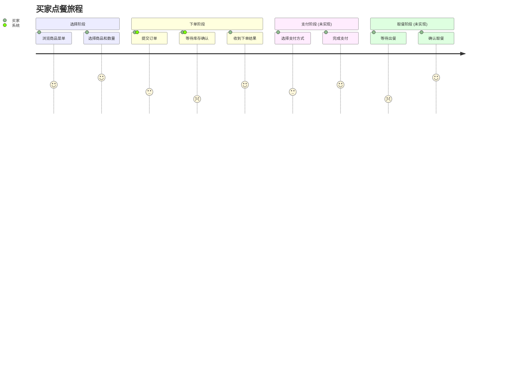
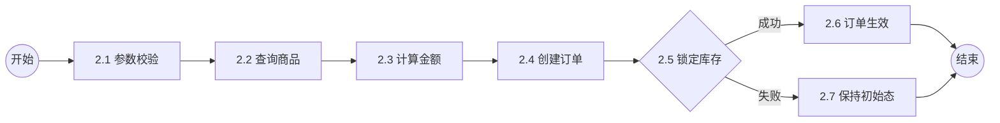

# 产品需求说明书 (PRD)

## 文档信息
| 属性 | 值 |
|------|-----|
| 版本 | 2.0 (逆向整理增强版) |
| 更新日期 | 2026-02-12 |
| 状态 | 逆向分析完成 |

### 版本记录

| **版本号** | **修订时间** | **修订人** | **内容概述** |
|-----------|------------|----------|-------------|
| V1.0.0 | 2026-02-11 | System | N 新建逆向分析初始版本 |
| V2.0.0 | 2026-02-12 | System | M 全面增强，补充业务流程、用例说明、库存模型、金额规则 |

---

## 产品概述

### 产品定位

餐饮行业数字化转型背景下的**核心交易引擎**，支撑点餐业务从下单到订单全生命周期管理的可靠后端服务。系统需在高并发场景下保证库存扣减的准确性和订单状态流转的一致性。

| **维度** | **说明** |
|---------|---------|
| 时间（When） | 顾客在营业时间内通过线上或线下渠道点餐 |
| 地点（Where） | 餐厅线上点餐平台 / 线下自助终端 |
| 人物（Who） | 买家（消费者）、卖家（商户） |
| 原因（Why） | 消费者需要便捷地完成点餐和支付 |
| 做什么（What） | 选择商品、下单、支付、取餐 |

### 目标用户

| **用户角色** | **用户规模** | **使用频率** | **痛点诉求** |
|------------|------------|------------|-------------|
| 买家 (Buyer) | 大众消费者 | 高频 (日均多次) | 快速下单、准确扣款、实时了解订单状态 |
| 卖家 (Seller) | 餐饮商户 | 持续在线 | 精确库存管理、订单不丢失、防止超卖 |

### 核心价值

> 构建餐厅点餐核心交易引擎，实现从下单到订单全生命周期管理的可靠服务。

**OKR**：
- **O**：提供稳定准确的点餐交易服务
  - KR1：下单成功率 ≥ 99.9%
  - KR2：库存扣减准确率 100%（无超卖）
  - KR3：下单接口 TP99 延迟 ≤ 200ms

## 产品设计

### 产品架构
| **产品** | **模块** | **职责边界** |
|---------|---------|-------------|
| 交易引擎 | 订单模块 (Order) | 1：订单创建与金额计算 2：订单状态机流转 3：订单持久化与查询 |
| 交易引擎 | 库存模块 (Inventory) | 1：库存锁定（下单预扣） 2：库存扣减（支付确认） 3：库存回退（取消/退款） |
| 交易引擎 | 商品模块 (Goods) | 1：商品信息查询 2：商品价格计算 |

### 用户旅程

---

### 功能清单

| **模块** | **功能** | **使用场景** | **前提条件** | **处理规则** | **后置处理** | **状态** |
|---------|---------|------------|------------|------------|------------|---------|
| 订单 | 购买下单 | 买家选好商品后提交 | buyerId/goodsId/itemCount 有效 | BR-001~BR-005 | 持久化订单、锁定库存 | ✅ 已实现 |
| 订单 | 订单查询 | 查看订单详情 | 订单已创建 | 按订单ID查询 | 返回订单信息 | ⬜ 占位 |
| 库存 | 库存锁定 | 下单时预扣库存 | 可用库存充足 | BR-004 | 可用库存→占用库存 | ✅ 已实现 |
| 库存 | 库存扣减 | 支付后确认扣减 | 已锁定库存 | 占用→已售 | 更新已售数量 | ⬜ 未实现 |
| 库存 | 库存回退 | 取消/退款释放库存 | 已售库存存在 | 已售→可用 | 恢复可用库存 | ⬜ 未实现 |
| 商品 | 商品查询 | 下单时获取商品信息 | 商品存在 | @Cacheable 缓存 | 返回 Goods 领域对象 | ✅ 已实现 |
| 支付 | 订单支付 | 买家支付订单 | 订单状态=CREATED | CREATED→PAID | 触发库存扣减 | ⬜ 未实现 |
| 订单 | 确认收货 | 买家确认收到商品 | 订单状态=PAID | PAID→CHECKED | - | ⬜ 未实现 |
| 订单 | 取消订单 | 买家取消未支付订单 | 订单状态=CREATED | CREATED→CANCELED | 库存回退 | ⬜ 未实现 |
| 订单 | 申请退款 | 买家申请退款 | 订单状态=PAID | PAID→REFUND | 库存回退 | ⬜ 未实现 |

### 用户故事

#### 订单模块
- 作为**买家**，我希望**提交购买请求创建订单并锁定库存**，以便**确保我选购的商品不会被他人抢购**
- 作为**买家**，我希望**查看订单详情**，以便**实时了解订单的当前状态**
- 作为**买家**，我希望**取消未支付订单**，以便**释放库存并更改选择**
- 作为**买家**，我希望**确认收货**，以便**完成交易流程**
- 作为**买家**，我希望**在支付后申请退款**，以便**处理不满意或错误订单的情况**

### 库存模块
- 作为**系统**，我希望**在下单时预扣库存**，以便**防止超卖**
- 作为**系统**，我希望**在支付确认后正式扣减库存**，以便**保持库存数据准确**
- 作为**系统**，我希望**在取消或退款时回退库存**，以便**恢复商品可售状态**

### 商品模块
- 作为**买家**，我希望**查询商品信息和价格**，以便**做出购买决策**

### 支付模块
- 作为**买家**，我希望**支付已创建的订单**，以便**完成购买流程**

## 产品流程

### 主流程

| 编码 | 业务流程 | 职责 | 输入 | 输出 |
|-----|---------|------|------|------|
| 1 | 选择商品 | 查询商品信息和价格 | goodsId | Goods (含 Price) |
| 2 | 发起下单 | 买家提交购买请求 | buyerId, goodsId, itemCount | OrderBuyRequest |
| 3 | 创建订单 | 计算金额，创建订单并持久化 | BuyerId, Goods, itemCount | Order (status=NEW) |
| 4 | 锁定库存 | 预扣减商品可用库存 | GoodsId, lock数量 | boolean (是否成功) |
| 5 | 订单生效 | 库存锁定成功后，订单状态流转 | Order (status=NEW) | Order (status=CREATED) |

### 子流程：下单处理

| 编码 | 业务活动 | 职责 | 输入 | 输出 |
|-----|---------|------|------|------|
| 2.1 | 参数校验 | 验证 buyerId、goodsId 非空，itemCount > 0 | OrderBuyRequest | boolean |
| 2.2 | 查询商品 | 通过商品 ID 查询商品详情（含缓存） | goodsId (Long) | Goods |
| 2.3 | 计算金额 | 商品单价 × 购买数量，含溢出校验 | Price, itemCount | MonetaryAmount |
| 2.4 | 创建订单 | 工厂方法创建订单，初始状态 NEW(0) | BuyerId, Goods, count | Order |
| 2.5 | 锁定库存 | 创建库存锁定记录 | GoodsId, lock | boolean |
| 2.6 | 订单生效 | 状态 NEW → CREATED | Order | Order (CREATED) |
| 2.7 | 保持初始态 | 库存锁定失败，订单不生效 | Order | Order (NEW) |

### 业务规则

| 规则ID | 描述 | 适用场景 | 代码实现位置 | 详细说明 |
|--------|------|----------|-------------|----------|
| BR-001 | 下单参数校验 | 接收请求时 | [OrderBuyRequest.validator()](../ai-master-api/src/main/java/com/only/ai/master/order/api/module/request/OrderBuyRequest.java) | buyerId/goodsId/itemCount 均不为 null，itemCount > 0 |
| BR-002 | 初始订单状态 | 订单创建 | [Order.create()](../ai-master-domain/src/main/java/com/only/ai/master/order/domain/model/Order.java) | 创建时默认 status = NEW(0) |
| BR-003 | 状态流转约束 | 订单生效 | [OrderStatus.create()](../ai-master-domain/src/main/java/com/only/ai/master/order/domain/model/OrderStatus.java) | 仅 NEW → CREATED，其他状态抛 IllegalStateException |
| BR-004 | 库存先锁后生效 | 下单编排 | [OrderApplicationService.doBuy()](../ai-master-application/src/main/java/com/only/ai/master/order/application/service/OrderApplicationService.java) | 锁定成功 → 订单 enable；失败 → 保持 NEW |
| BR-005 | 金额计算公式 | 订单创建 | [Price.calculateAmount()](../ai-master-domain/src/main/java/com/only/ai/master/goods/domain/model/Price.java) | 总价 = 单价(分) × 数量，含 Long.MAX_VALUE 溢出检查 |
| BR-006 | ID合法性校验 | 全局 | [Id](../ai-master-domain/src/main/java/com/only/ai/master/common/domain/Id.java) | 所有 ID 值对象: 非 null 且 > 0 |
| BR-007 | 金额合法性 | 全局 | [MonetaryAmount.create()](../ai-master-domain/src/main/java/com/only/ai/master/common/domain/MonetaryAmount.java) | amount/cent ≥ 0, scale ≥ 0 |
| BR-008 | 持久化失败处理 | 订单状态更新 | [OrderDao.enable()](../ai-master-infrastructure/src/main/java/com/only/ai/master/order/infrastructure/dao/OrderDao.java) | DB 更新 count=0 时抛 IllegalStateException |

---

## 非功能需求

- **性能要求**:
  - 下单接口 TP99 RT ≤ 200ms，@Call(elapsed=1200) 监控
  - 商品查询使用 @Cacheable 缓存，减少外部调用
- **安全要求**:
  - 金额计算含 Long 溢出校验 (Price.calculateAmount)
  - 所有 ID 值 > 0 强校验
- **兼容性**:
  - 支持 HTTP REST API (`POST /api/order/buy`) 和 RPC (`OrderService.buy()`) 双协议接入
- **一致性**:
  - 订单创建与库存锁定需保持数据一致性
- **可观测性**:
  - Transformer @Call 注解提供方法级监控

### 用户权限

| **用户角色** | **功能项** | **用户权限** | **数据范围** |
|------------|----------|------------|------------|
| 买家 | 下单购买 | 创建订单、查看自己的订单 | 个人订单 |
| 卖家 | 商品管理 | 管理自己的商品和库存 | 本店商品 |
| 系统 | 库存锁定 | 自动扣减和回退 | 全局库存 |

---

## 参考文档

- 项目知识库: [AGENTS.md](../AGENTS.md)
- 架构设计: [docs/add.md](add.md)
- 测试设计: [docs/tdd.md](tdd.md)
- API 文档: [docs/api/README.md](api/README.md)
