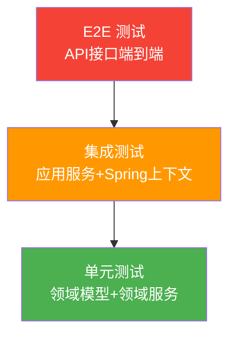

# 测试设计说明书 (TDD)

## 文档信息

| 属性 | 值 |
|------|-----|
| 版本 | 2.0 (逆向整理增强版) |
| 更新日期 | 2026-02-12 |

## 测试现状分析

### 现有测试覆盖

| 指标 | 当前值 | 目标值 |
|------|--------|--------|
| 单元测试文件数 | **0** | 15+ |
| 单元测试覆盖率 | **0%** | ≥80% |
| 集成测试 | **无** | 核心链路覆盖 |
| E2E测试 | **无** | 下单流程覆盖 |

### 测试框架 (项目已具备)

| 类型 | 框架 | 版本 | 说明 |
|------|------|------|------|
| 单元测试 | JUnit 5 | (Spring Boot 内置) | 标准 Java 测试框架 |
| Mock 工具 | Mockito | (Spring Boot 内置) | 模拟对象行为 |
| 断言库 | AssertJ | (Spring Boot 内置) | 流式断言风格 |
| 集成测试 | Spring Boot Test | (Spring Boot 内置) | 启动 Spring 上下文 |
| 覆盖率 | Jacoco | 需引入 | 代码覆盖率报告 |

## 测试策略

### 测试分层



| 层级 | 覆盖范围 | 优先级 | Mock 策略 | 数据源 |
|------|---------|--------|----------|--------|
| **单元测试** | 领域模型、值对象、领域服务 | **P0 最高** | 不 Mock 领域对象；Mock 仓储接口 | 内存数据 |
| **集成测试** | 应用服务、仓储实现 | P1 | Mock 外部服务 (GoodsCall) | H2 内存库 |
| **E2E 测试** | HTTP 接口完整链路 | P2 | Mock 外部服务 | H2 内存库 |

### 测试原则
- **FIRST**: Fast, Independent, Repeatable, Self-validating, Timely
- **AAA 模式**: Arrange (Given), Act (When), Assert (Then)
- **单一断言**: 每个测试方法验证一个行为
- **命名规范**: `should{ExpectedBehavior}When{Condition}`

## 测试用例清单

### 一、领域层 (Domain Layer) - P0

#### 1.1 Order 聚合根

| 用例ID | 描述 | 前置条件 | 步骤 | 期望结果 | 覆盖规则 |
|--------|------|----------|------|----------|----------|
| TC-DOM-001 | 成功创建订单 | 有效 BuyerId, Goods(含Price), count=2 | `Order.create(buyerId, goods, 2)` | 状态=NEW, 金额=单价×2, goodsId/buyerId/sellerId 正确 | BR-002, BR-005 |
| TC-DOM-002 | 订单生效流转 | 订单状态 NEW | `order.enable()` | 状态变为 CREATED | BR-003 |
| TC-DOM-003 | 非法状态流转 | 订单状态 CREATED | `order.enable()` | 抛出 IllegalStateException | BR-003 |
| TC-DOM-004 | 空状态生效 | 订单 status=null | `order.enable()` | 抛出 IllegalStateException("status is null") | - |

```java
// TC-DOM-001 示例
@Test
public void shouldCreateOrderWithCorrectAmountAndStatus() {
    // Given
    BuyerId buyerId = BuyerId.create(100L);
    Price price = Price.create(1000); // 10.00 元
    Goods goods = new Goods(GoodsId.create(1L), "测试商品", price);

    // When
    Order order = Order.create(buyerId, goods, 3);

    // Then
    assertEquals(OrderStatus.NEW, order.getStatus());
    assertEquals(3000L, order.getAmount().value()); // 10.00 × 3 = 30.00 元 = 3000 分
    assertEquals(1L, order.getGoodsId().value());
    assertEquals(100L, order.getBuyerId().value());
}
```

#### 1.2 OrderStatus 枚举

| 用例ID | 描述 | 前置条件 | 步骤 | 期望结果 |
|--------|------|----------|------|----------|
| TC-DOM-005 | NEW 可流转为 CREATED | status=NEW | `NEW.create()` | 返回 CREATED |
| TC-DOM-006 | CREATED 不可调用 create | status=CREATED | `CREATED.create()` | 抛 IllegalStateException |
| TC-DOM-007 | PAID 不可调用 create | status=PAID | `PAID.create()` | 抛 IllegalStateException |
| TC-DOM-008 | 状态枚举值对应 | - | 遍历枚举 | NEW=0, CREATED=1, PAID=2, ... NONE=-1 |

#### 1.3 Price 值对象

| 用例ID | 描述 | 前置条件 | 步骤 | 期望结果 |
|--------|------|----------|------|----------|
| TC-DOM-009 | 正常金额计算 | price=1000分 | `price.calculateAmount(3)` | 3000 分 |
| TC-DOM-010 | 金额溢出检查 | price=Long.MAX_VALUE/2 分 | `price.calculateAmount(3)` | 抛 IllegalArgumentException("amount is overflow") |
| TC-DOM-011 | 单件计算 | price=500分 | `price.calculateAmount(1)` | 500 分 |

#### 1.4 MonetaryAmount 值对象

| 用例ID | 描述 | 前置条件 | 步骤 | 期望结果 |
|--------|------|----------|------|----------|
| TC-DOM-012 | 元创建金额 | amount=10.50 | `MonetaryAmount.create(10.50)` | getAmount()=10.50, getCent()=1050 |
| TC-DOM-013 | 分创建金额 | cent=1050 | `MonetaryAmount.create(1050L)` | getAmount()=10.50, getCent()=1050 |
| TC-DOM-014 | 负数金额校验 | amount=-1 | `MonetaryAmount.create(-1.0)` | 抛 IllegalArgumentException |
| TC-DOM-015 | 折扣计算 | amount=100元 | `.discount(0.88)` | 88.00 元 |
| TC-DOM-016 | 金额加法 | amount=100元 | `.add(50.0)` | 150.00 元 |
| TC-DOM-017 | 金额减法 | amount=100元 | `.subtract(30.0)` | 70.00 元 |
| TC-DOM-018 | 余额不足扣减 | amount=10元 | `.subtract(20.0)` | 抛 IllegalArgumentException("balance is not enough") |
| TC-DOM-019 | 格式化输出 | amount=88.88元 | `.format()` | "￥88.88" |

#### 1.5 Id 抽象基类

| 用例ID | 描述 | 前置条件 | 步骤 | 期望结果 |
|--------|------|----------|------|----------|
| TC-DOM-020 | 有效 ID 创建 | id=100 | `OrderId.create(100L)` | value()=100 |
| TC-DOM-021 | null ID 校验 | id=null | `OrderId.create(null)` | 抛 IllegalArgumentException("id is null") |
| TC-DOM-022 | 零值 ID 校验 | id=0 | `OrderId.create(0L)` | 抛 IllegalArgumentException("id must gt 0") |
| TC-DOM-023 | 负值 ID 校验 | id=-1 | `OrderId.create(-1L)` | 抛 IllegalArgumentException("id must gt 0") |

#### 1.6 Inventory 值对象

| 用例ID | 描述 | 前置条件 | 步骤 | 期望结果 |
|--------|------|----------|------|----------|
| TC-DOM-024 | 创建锁定库存 | goodsId=1, lock=5 | `Inventory.createLock(GoodsId.create(1L), 5)` | 对象创建成功，lock=5 |

#### 1.7 领域服务

| 用例ID | 描述 | 前置条件 | 步骤 | 期望结果 |
|--------|------|----------|------|----------|
| TC-DOM-025 | OrderDomainService.create 成功 | Mock OrderRepository | 调用 create(buyerId, goods, 2) | 返回 Order, 调用 repository.create 一次 |
| TC-DOM-026 | OrderDomainService.enable 成功 | Mock OrderRepository, order.status=NEW | 调用 enable(order) | 状态变 CREATED, 调用 repository.enable 一次 |
| TC-DOM-027 | InventoryDomainService.lock 成功 | Mock InventoryRepository 返回 true | 调用 lock(goodsId, 5) | 返回 true |
| TC-DOM-028 | InventoryDomainService.lock 失败 | Mock InventoryRepository 返回 false | 调用 lock(goodsId, 5) | 返回 false |

### 二、应用层 (Application Layer) - P0

#### 2.1 OrderApplicationService

| 用例ID | 描述 | 前置条件 | 步骤 | 期望结果 |
|--------|------|----------|------|----------|
| TC-APP-001 | 完整下单流程-成功 | Mock: Goods存在, 库存锁定成功 | `doBuy(command)` | 订单创建成功, status=CREATED, 金额正确 |
| TC-APP-002 | 库存锁定失败 | Mock: Goods存在, 库存锁定返回false | `doBuy(command)` | 订单创建成功但 status=NEW (未生效) |
| TC-APP-003 | 结果映射正确 | Mock: 完整flow | `doBuy(command)` | OrderBuyResult 各字段与 Order 一致 |

```java
// TC-APP-001 示例
@RunWith(MockitoJUnitRunner.class)
public class OrderApplicationServiceTest {
    @Mock private InventoryLockAction inventoryLockAction;
    @Mock private OrderCreateAction orderCreateAction;
    @Mock private OrderEnableAction orderEnableAction;
    @InjectMocks private OrderApplicationService service;

    @Test
    public void shouldCreateOrderAndEnableWhenInventoryLocked() {
        // Given
        OrderBuyCommand command = new OrderBuyCommand();
        command.setBuyerId(100L);
        command.setGoodsId(1L);
        command.setItemCount(2);

        Order mockOrder = createMockOrder(OrderStatus.NEW);
        when(orderCreateAction.create(command)).thenReturn(mockOrder);
        when(inventoryLockAction.lock(mockOrder)).thenReturn(true);

        // When
        OrderBuyResult result = service.doBuy(command);

        // Then
        verify(orderCreateAction).create(command);
        verify(inventoryLockAction).lock(mockOrder);
        verify(orderEnableAction).enable(mockOrder);
    }
}
```

#### 2.2 OrderCreateAction

| 用例ID | 描述 | 前置条件 | 步骤 | 期望结果 |
|--------|------|----------|------|----------|
| TC-APP-004 | 创建订单动作 | Mock ItemQueryFacade 返回 Goods | `create(command)` | 调用 itemQueryFacade + orderDomainService.create |

#### 2.3 InventoryLockAction

| 用例ID | 描述 | 前置条件 | 步骤 | 期望结果 |
|--------|------|----------|------|----------|
| TC-APP-005 | 锁定库存动作 | Mock InventoryDomainService 返回 true | `lock(order)` | 调用 inventoryDomainService.lock(goodsId, itemCount) |

### 三、服务层 (Service Layer) - P1

#### 3.1 OrderController

| 用例ID | 描述 | 前置条件 | 步骤 | 期望结果 |
|--------|------|----------|------|----------|
| TC-SVC-001 | 下单接口正常 | Mock ApplicationService | POST /api/order/buy 有效参数 | 200 OK, success=true |
| TC-SVC-002 | 参数校验失败 | - | POST /api/order/buy 空参数 | 200 OK, success=false, code=PARAM_ERROR |

#### 3.2 OrderServiceProvider

| 用例ID | 描述 | 前置条件 | 步骤 | 期望结果 |
|--------|------|----------|------|----------|
| TC-SVC-003 | RPC 参数校验失败 | buyerId=null | `buy(request)` | 返回 fail("PARAM_ERROR", ...) |
| TC-SVC-004 | RPC 下单正常 | 有效参数 | `buy(request)` | 调用 applicationService.doBuy + 返回 success |

### 四、基础设施层 (Infrastructure Layer) - P1

#### 4.1 OrderDao

| 用例ID | 描述 | 前置条件 | 步骤 | 期望结果 |
|--------|------|----------|------|----------|
| TC-INF-001 | 创建订单持久化 | H2 内存库 | `create(order)` | order.orderId 被设置，DB 中有记录 |
| TC-INF-002 | 订单生效更新 | 订单已存在 | `enable(order)` | 返回 true，DB status 更新 |
| TC-INF-003 | 订单生效失败 | 订单不存在 | `enable(order)` | 抛 IllegalStateException |

#### 4.2 GoodsDal

| 用例ID | 描述 | 前置条件 | 步骤 | 期望结果 |
|--------|------|----------|------|----------|
| TC-INF-004 | 商品查询与转换 | Mock GoodsCall 返回 GoodsEntity | `acquireGoods(1L)` | 返回 Goods 领域对象，字段映射正确 |

#### 4.3 工厂类

| 用例ID | 描述 | 前置条件 | 步骤 | 期望结果 |
|--------|------|----------|------|----------|
| TC-INF-005 | OrderFactory 转换 | 有效 Order 对象 | `OrderFactory.instance(order)` | OrderEntity 各字段对应正确 |
| TC-INF-006 | GoodsFactory 转换 | 有效 GoodsEntity | `GoodsFactory.valueOf(entity)` | Goods 各字段正确，Price 正确创建 |

## 测试用例统计

| 层级 | 用例数 | 优先级 | 覆盖目标 |
|------|--------|--------|---------|
| 领域层 (Domain) | **28** | P0 | Order, OrderStatus, Price, MonetaryAmount, Id, Inventory, 领域服务 |
| 应用层 (Application) | **5** | P0 | OrderApplicationService, Actions |
| 服务层 (Service) | **4** | P1 | Controller, Provider |
| 基础设施层 (Infrastructure) | **6** | P1 | Dao, Dal, Factory |
| **合计** | **43** | - | - |

## 测试数据

### Mock 策略

| 依赖类型 | 单元测试 | 集成测试 |
|---------|---------|---------|
| 领域对象 | **不 Mock**，使用真实对象 | 不 Mock |
| 仓储接口 | Mock (Mockito) | 使用 H2 内存库 |
| 外部服务 (GoodsCall) | Mock | Mock |
| 领域服务 | 视情况 Mock | 不 Mock |

### 测试数据库配置

```yaml
# application-test.yml
spring:
  datasource:
    url: jdbc:h2:mem:testdb;DB_CLOSE_DELAY=-1;DB_CLOSE_ON_EXIT=FALSE
    driver-class-name: org.h2.Driver
    username: sa
    password:
```

## 测试执行

### 命令

```bash
# 单元测试
mvn test -Dtest=*Test -pl ai-master-domain

# 应用层测试
mvn test -Dtest=*Test -pl ai-master-application

# 全量测试
mvn test

# 覆盖率报告
mvn test jacoco:report
```

### 质量门禁

| 指标 | 阈值 | 检查工具 |
|------|------|----------|
| 单元测试覆盖率 | ≥80% | Jacoco |
| 代码重复率 | ≤5% | PMD/CPD |
| 严重漏洞 | 0 | SonarQube |
| 编译警告 | 0 | Maven/Compiler |

## 参考文档

- 测试规范: `~/ai/rules/testing/testing-guidelines.md`
- 产品需求: [docs/prd.md](prd.md)
- 架构设计: [docs/add.md](add.md)
