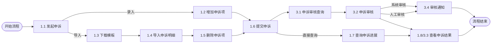
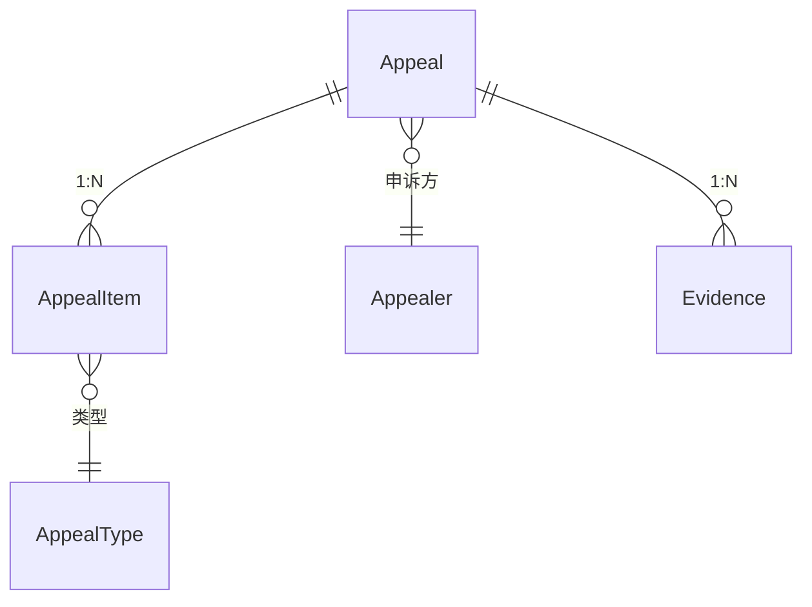
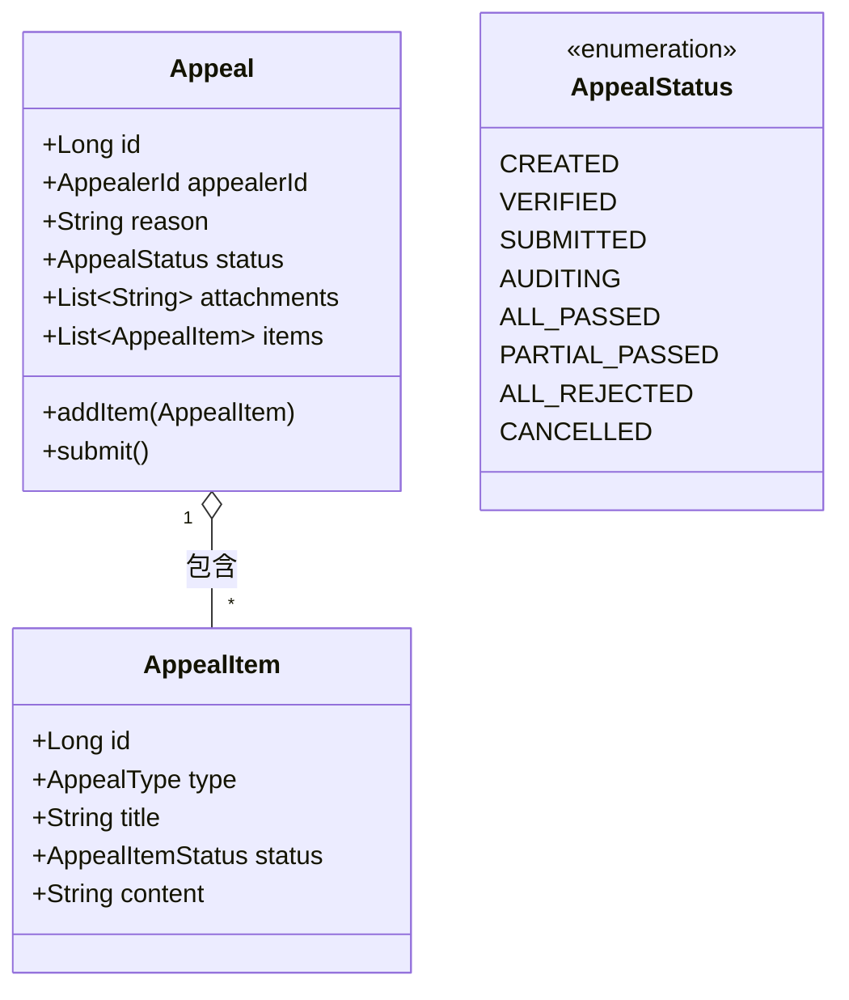

# 申诉详细设计（优化版）

> 本文档基于技术规范优化，严格遵循《详细设计模板》和DDD六边形架构原则，确保技术实现一致性。

## 一、业务分析

> 本章节用于梳理申诉业务的核心概念、业务流程、领域模型和系统能力，为后续详细设计提供业务基础。

### 1. 名词定义
> 本节定义申诉相关的核心名词，介绍名词含义和典型案例，便于统一理解。

|名词|含义|举例|
|-----|-----|---|
| 申诉单 | 记录并管理用户发起的所有申诉事项的聚合根对象 | 某用户发起一条申诉，系统生成一条申诉记录 |
| 申诉项 | 申诉单下具体的申诉明细，支持多类型申诉 | 一条申诉单下有多个申诉项，分别可以申诉不同类型 |
| 申诉类型 | 申诉项的类型及名称，区分不同申诉业务 | 费用、重量、目的地申诉等类型 |
| 申诉方 | 发起申诉的主体，可为网点、中心等 | 网点A、中心C作为申诉方发起申诉 |

### 2. 业务流程
> 表达业务流程流转，每个节点均为业务活动（a.b两位数字编码）。
> 使用mermaid流程图，体现全流程主要节点。业务流程的节点，跟能力定义的API能力、容器架构、API设计数字编码一一对应。
> 业务流程严格对应架构图数字编码，体现申诉全流程主要节点。



### 3. 领域模型
> 本节采用领域驱动设计（DDD），描述核心领域对象及其关系。

|领域对象|对象类型|对象属性|
|---|---|---|
|Appeal（申诉单）|聚合根|id、appealerId（申诉方id）、reason（申诉理由）、status（申诉状态）、attachments（附件列表）、items（申诉项列表）|
|AppealItem（申诉项）|实体|id、type（申诉类型）、code（申诉项编码）、title（申诉项标题）、status（申诉项状态）、content（申诉内容）|
|AppealType（申诉类型）|值对象|type（申诉类型）、title（申诉类型名）|
|Appealer（申诉方）|实体|id、code（申诉方编码）、type（申诉方类型）|

> 领域对象关系ER图：


### 4. 能力定义
> 本节定义每个业务活动对应的API能力，包括编号、归属系统、功能说明、SLA协议。

|业务活动|归属系统|能力说明|SLA协议|
|---|---|---|---|
|1.1 发起申诉|申诉服务|创建申诉单，录入申诉基础信息（订单号、类型、理由、证据）|TPS 200<br/>TP95 150ms<br/>TP99 300ms|
|1.2 增加申诉项|申诉服务|为申诉单添加申诉项（类型、内容）|TPS 300<br/>TP95 100ms<br/>TP99 200ms|
|1.3 下载模板|申诉服务/文件存储|下载申诉明细导入模板|QPS 100<br/>TP95 150ms<br/>TP99 300ms|
|1.4 导入申诉明细|申诉服务|批量导入申诉项明细（文件上传、校验、入库）|TPS 100<br/>TP95 200ms<br/>TP99 350ms|
|1.5 删除申诉项|申诉服务|删除指定申诉项|TPS 300<br/>TP95 100ms<br/>TP99 200ms|
|1.6 提交申诉|申诉服务|提交申诉单，进入审核流程|TPS 100<br/>TP95 100ms<br/>TP99 250ms|
|3.1 申诉审核查询|申诉服务|查询待审核申诉单及明细|QPS 100<br/>TP95 100ms<br/>TP99 200ms|
|3.2 申诉审核|申诉服务|系统/人工审核申诉单及项，记录审核意见|TPS 150<br/>TP95 100ms<br/>TP99 200ms|
|3.4 审核通知|申诉服务/MQ|申诉审核结果异步通知（MQ推送）|TPS 300<br/>TP95 50ms<br/>TP99 200ms|
|1.7 查询申诉进展|申诉服务|查询申诉单处理进展|QPS 200<br/>TP95 200ms<br/>TP99 400ms|
|1.8/3.3 查看申诉结果|申诉服务|查询申诉单最终审核结果|QPS 300<br/>TP95 150ms<br/>TP99 300ms|

## 二、详细设计

> 本章节对申诉系统的技术实现进行详细设计，包括容器架构、API设计、逻辑模型、数据模型等，确保设计可落地、可维护、可扩展。

### 1. 容器架构
> 基于六边形架构（Clean Architecture）设计，明确各层职责边界。

#### 服务划分
- **申诉APP（前端）**：Vue/React实现，提供用户申诉入口
- **申诉服务**：Spring Boot 2.7.10+，负责申诉全生命周期管理
- **文件存储**：支持文件上传/下载，CDN加速
- **申诉数据库**：MySQL 8.0，支持JSON字段和分区表
- **申诉通知**：RocketMQ异步消息推送
- **收单服务**：外部计费/凭证服务对接

#### 六边形架构层次
```
┌─────────────────────────────────────────┐
│               用户界面层                 │
│              (Controller)               │
├─────────────────────────────────────────┤
│               应用层                    │
│         AppealApplicationService        │
├─────────────────────────────────────────┤
│               领域层                    │
│       Appeal (Aggregate Root)          │
│       AppealItem (Entity)              │
├─────────────────────────────────────────┤
│              基础设施层                 │
│        AppealRepositoryImpl            │
│        AppealJpaRepository             │
└─────────────────────────────────────────┘
```

### 2. API设计
> 基于RESTful设计原则，符合Java命名规范。

|API事项|具体说明|
|----|----|
|API名称|1.1 发起申诉|
|API签名|`com.ai.master.appeal.api.AppealService.create`|
|请求参数|`{"reason":"申诉原因", "appealItem":{"appealCode":"申诉项标识","appealType":"重量｜费用","content":{"weight":2.0, "fee":4.5}}}`|
|响应结果|`{"appealId":"","status":"已创建"}`|
|关键步骤|- 创建申诉单<br/>- 查询凭证<br/>- 更新申诉单|
|异常码|APPEAL_ITEM_EMPTY(40001)|

### 3. 逻辑模型
> 基于领域模型设计，符合DDD六边形架构。

#### 关键类图


### 4. 数据模型
> 基于MySQL 8.0设计，支持JSON字段和分区表。

#### 技术栈规范
- **Java版本**: 17+ (支持record、sealed接口)
- **框架**: Spring Boot 2.7.10+ + MyBatis-Plus
- **数据库**: MySQL 8.0 (支持JSON字段)
- **工具**: Lombok、MapStruct 1.5+

#### 表结构
```sql
-- 申诉单
CREATE TABLE `appeal` (
    `id` bigint NOT NULL PRIMARY KEY COMMENT '申诉单ID',
    `appealer_id` bigint NOT NULL COMMENT '申诉方ID',
    `reason` varchar(255) COMMENT '申诉理由',
    `status` varchar(20) NOT NULL COMMENT '申诉状态',
    `attachments` json COMMENT '附件列表',
    `created_at` datetime DEFAULT CURRENT_TIMESTAMP,
    `updated_at` datetime DEFAULT CURRENT_TIMESTAMP ON UPDATE CURRENT_TIMESTAMP,
    INDEX idx_appealer (appealer_id),
    INDEX idx_status (status)
) ENGINE=InnoDB DEFAULT CHARSET=utf8mb4 COMMENT='申诉单表';

-- 申诉项
CREATE TABLE `appeal_item` (
    `id` bigint NOT NULL PRIMARY KEY COMMENT '申诉项ID',
    `appeal_id` bigint NOT NULL COMMENT '申诉单ID',
    `type` varchar(20) NOT NULL COMMENT '申诉类型编码',
    `title` varchar(100) COMMENT '申诉项标题',
    `status` varchar(20) NOT NULL COMMENT '申诉项状态',
    `content` varchar(255) COMMENT '申诉内容',
    `created_at` datetime DEFAULT CURRENT_TIMESTAMP,
    `updated_at` datetime DEFAULT CURRENT_TIMESTAMP ON UPDATE CURRENT_TIMESTAMP,
    FOREIGN KEY (`appeal_id`) REFERENCES `appeal` (`id`) ON DELETE CASCADE,
    INDEX idx_appeal (appeal_id),
    INDEX idx_type (type)
) ENGINE=InnoDB DEFAULT CHARSET=utf8mb4 COMMENT='申诉项表';

-- 申诉方
CREATE TABLE `appealer` (
    `id` bigint NOT NULL PRIMARY KEY COMMENT '申诉方ID',
    `code` varchar(50) NOT NULL COMMENT '申诉方编码',
    `type` varchar(20) NOT NULL COMMENT '申诉方类型',
    `created_at` datetime DEFAULT CURRENT_TIMESTAMP,
    UNIQUE KEY uk_code (code)
) ENGINE=InnoDB DEFAULT CHARSET=utf8mb4 COMMENT='申诉方表';
```

### 5. 六边形架构实现指南

#### 端口定义（API层）
```java
// 应用层端口 - 申诉命令服务
package com.ai.master.appeal.api;

public interface AppealService {
    AppealDTO create(CreateAppealCommand command);
    void addItem(AddAppealItemCommand command);
    void submit(SubmitAppealCommand command);
    void audit(AuditAppealCommand command);
}

// 应用层端口 - 申诉查询服务
public interface AppealQueryService {
    AppealDTO findById(Long appealId);
    PageResult<AppealDTO> query(AppealQuery query);
    List<AppealProgressDTO> getProgress(Long appealId);
}
```

#### 领域层设计
```java
// 聚合根 - 符合DDD规范
package com.ai.master.appeal.domain;

@Entity
@Table(name = "appeal")
public class Appeal extends AggregateRoot<Long> {
    @Id
    @GeneratedValue(strategy = GenerationType.IDENTITY)
    private Long id;
    
    @Embedded
    private AppealerId appealerId;
    
    @Column(nullable = false)
    private String reason;
    
    @Enumerated(EnumType.STRING)
    @Column(nullable = false)
    private AppealStatus status = AppealStatus.CREATED;
    
    @ElementCollection
    @CollectionTable(name = "appeal_attachment", joinColumns = @JoinColumn(name = "appeal_id"))
    @Column(name = "attachment_url")
    private List<String> attachments = new ArrayList<>();
    
    @OneToMany(mappedBy = "appeal", cascade = CascadeType.ALL, orphanRemoval = true)
    private List<AppealItem> items = new ArrayList<>();
    
    // 领域行为
    public void addItem(AppealItem item) {
        item.setAppeal(this);
        items.add(item);
        registerEvent(new AppealItemAddedEvent(id, item.getId()));
    }
    
    public void submit() {
        if (items.isEmpty()) {
            throw new InvalidAppealException("申诉单必须包含至少一个申诉项");
        }
        this.status = AppealStatus.SUBMITTED;
        registerEvent(new AppealSubmittedEvent(id));
    }
}
```

#### 基础设施层实现
```java
// 仓储实现
package com.ai.master.appeal.infrastructure;

@Repository
@RequiredArgsConstructor
public class AppealRepositoryImpl implements AppealRepository {
    private final AppealJpaRepository jpaRepository;
    private final AppealItemJpaRepository itemJpaRepository;
    
    @Override
    public Appeal save(Appeal appeal) {
        return jpaRepository.save(appeal);
    }
    
    @Override
    public Optional<Appeal> findById(Long id) {
        return jpaRepository.findById(id);
    }
}
```

### 6. 统一异常处理设计

#### 异常码定义
|异常码|异常类型|描述|HTTP状态码|
|---|---|---|---|
|APPEAL_NOT_FOUND|业务异常|申诉单不存在|404|
|INVALID_APPEAL_STATUS|业务异常|申诉状态不合法|400|
|APPEAL_ITEM_EMPTY|业务异常|申诉项为空|400|
|APPEAL_ALREADY_SUBMITTED|业务异常|申诉已提交|409|
|EXTERNAL_SERVICE_ERROR|系统异常|外部服务调用失败|503|

#### 异常响应格式
```json
{
  "code": "APPEAL_NOT_FOUND",
  "message": "申诉单不存在",
  "details": "申诉单ID: 12345",
  "timestamp": "2024-01-01T12:00:00Z",
  "path": "/api/appeals/12345"
}
```

### 7. 测试策略设计

#### 单元测试用例
```java
@Test
public void shouldCreateAppealWithItems() {
    // Given
    CreateAppealCommand command = CreateAppealCommand.builder()
        .reason("费用计算错误")
        .items(List.of(
            AppealItemCommand.of("WEIGHT", "重量申诉内容"),
            AppealItemCommand.of("FEE", "费用申诉内容")
        ))
        .build();
    
    // When
    AppealDTO result = appealService.create(command);
    
    // Then
    assertThat(result.getId()).isNotNull();
    assertThat(result.getStatus()).isEqualTo(AppealStatus.CREATED);
    assertThat(result.getItems()).hasSize(2);
}
```

#### 集成测试场景
1. 创建申诉单并添加申诉项
2. 提交申诉单触发验证  
3. 审核申诉单状态流转
4. 并发提交申诉处理

### 8. 性能优化建议

#### 数据库优化
- 申诉单表：按申诉方ID分区
- 申诉项表：按申诉单ID建立联合索引
- 状态字段：建立位图索引

#### 缓存策略
- 申诉单详情：Redis缓存，TTL=5分钟
- 申诉方信息：本地缓存，TTL=30分钟
- 模板文件：CDN缓存，TTL=1小时

## 三、编码规范

### 包结构规范
```
com.ai.master.appeal
├── api              # API接口定义
├── application      # 应用服务层
├── domain           # 核心业务领域
├── infrastructure   # 技术实现层
└── common           # 共享工具类
```

### 命名规范
- **聚合根**: Appeal
- **实体**: AppealItem
- **值对象**: AppealStatus
- **仓储接口**: AppealRepository
- **仓储实现**: AppealRepositoryImpl

### 开发规范
- 遵循《Java开发规范》
- 单元测试覆盖率≥80%
- 代码重复率≤5%
- 所有公共API必须有JavaDoc